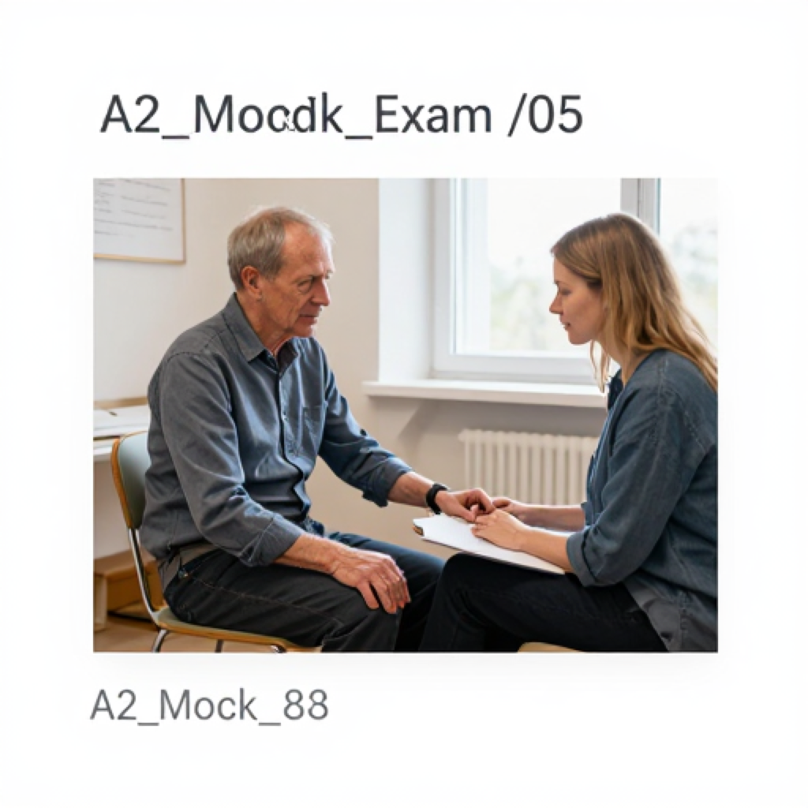
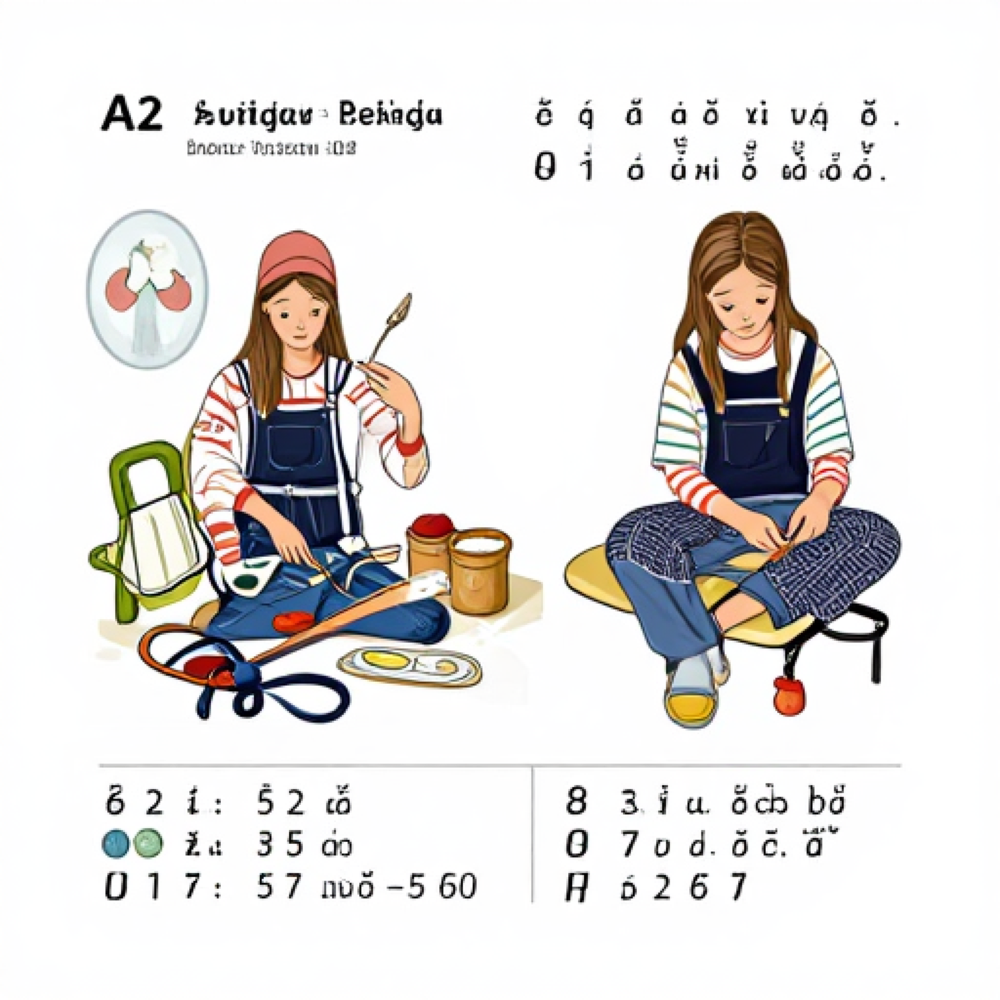
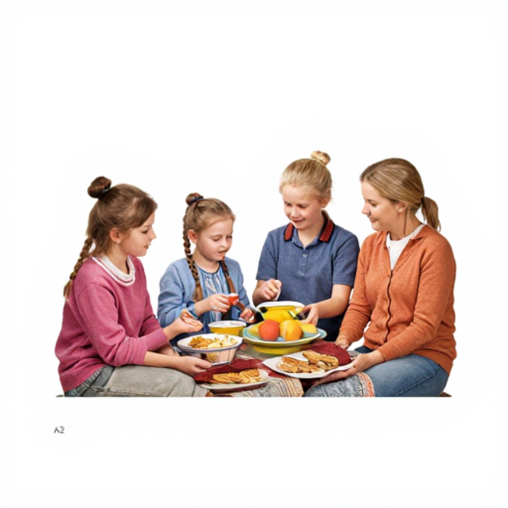
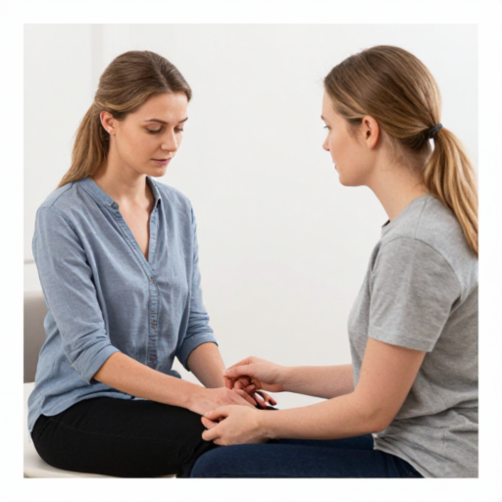
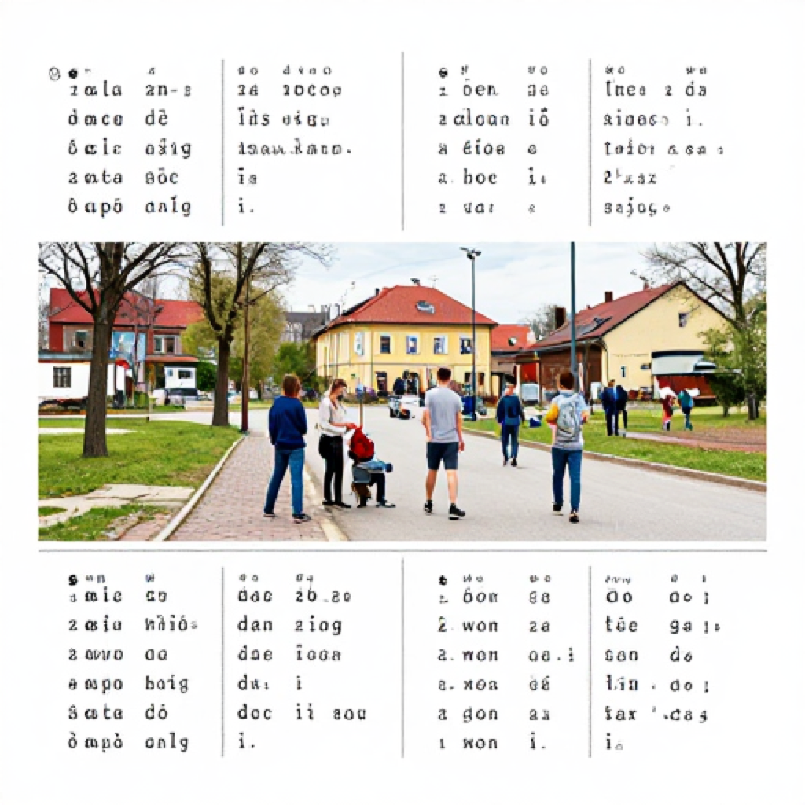

# A2 Mock Exam 05

> Audio attachments in this exam are generated locally with Piper using the Latvian voice `lv_LV-rudolfs-medium`.

## Student Version

Klausīšanās – 15 punkti  
Lasīšana – 15 punkti  
Rakstīšana – 15 punkti  
Runāšana – 15 punkti  
Kopā – 60 punkti  
Lai nokārtotu: vismaz 9 punkti katrā prasmē (minimum 9 points in each skill)

### Klausīšanās prasmes pārbaude

Laiks – 25 minūtes

#### 1. uzdevums

<audio controls preload="none">
  <source src="Attachments/A2_Mock_Exam_05/klausisanas_1_uzdevums.mp3" type="audio/mpeg">
  Your browser does not support the audio element.
</audio>

[Audio failsafe link](Attachments/A2_Mock_Exam_05/klausisanas_1_uzdevums.mp3)

Klausieties paziņojumus! Katrs paziņojums skanēs divas reizes.  
Pēc katra paziņojuma atzīmējiet pareizo atbildi!

1. Cikos ģimenes ārsts pieņem sestdien?
   - a) No 8.00 līdz 12.00
   - b) No 9.00 līdz 13.00
   - c) No 10.00 līdz 14.00
2. Kur atrodas aptieka tirdzniecības centrā?
   - a) Pirmajā stāvā pie eskalatora
   - b) Otrajā stāvā pie kafejnīcas
   - c) Pie autostāvvietas
3. Ko nedrīkst darīt pirms asins analīzēm?
   - a) Dzert ūdeni
   - b) Vilkt jaku
   - c) Ēst brokastis
4. Cikos būs vizīte pie zobārsta?
   - a) 14.30
   - b) 15.30
   - c) 16.30
5. Cik maksā klepus sīrups?
   - a) 3.20 eiro
   - b) 4.20 eiro
   - c) 5.20 eiro
6. Kur notiks rīta vingrošana?
   - a) Parkā
   - b) Sporta hallē
   - c) Peldbaseinā

#### 2. uzdevums

<audio controls preload="none">
  <source src="Attachments/A2_Mock_Exam_05/klausisanas_2_uzdevums.mp3" type="audio/mpeg">
  Your browser does not support the audio element.
</audio>

[Audio failsafe link](Attachments/A2_Mock_Exam_05/klausisanas_2_uzdevums.mp3)

Klausieties sarunu! Saruna skanēs divas reizes.  
Atzīmējiet, vai apgalvojums ir pareizs (`Jā`) vai nepareizs (`Nē`)!

1. Andrim sāp kakls.
2. Viņš slimo jau nedēļu.
3. Ārsts izraksta antibiotikas.
4. Andrim rīt jāpaliek mājās.

#### 3. uzdevums

<audio controls preload="none">
  <source src="Attachments/A2_Mock_Exam_05/klausisanas_3_uzdevums.mp3" type="audio/mpeg">
  Your browser does not support the audio element.
</audio>

[Audio failsafe link](Attachments/A2_Mock_Exam_05/klausisanas_3_uzdevums.mp3)

Klausieties sarunas! Sarunas skanēs divas reizes.  
Ievelciet atbilstošo skaitli vai vārdu! Četras atbildes ir liekas.

1. Vizīte pie zobārsta būs pulksten `_____`.
2. Sieviete pērk zāles `_____`.
3. Ārsts iesaka dzert siltu `_____`.
4. Pacients slimnīcā paliks `_____` dienas.
5. Autobusā viņš uzlika `_____`.

Atbilžu varianti: `aptiekā`, `15.30`, `tēju`, `divas`, `masku`, `9.00`, `galvu`, `pienu`, `rīt`

### Lasītprasmes pārbaude

Laiks – 30 minūtes

#### 1. uzdevums

Lasiet tekstu un atzīmējiet, kurš apgalvojums ir pareizs!

**Teksts 1**

Pilsētas poliklīnika informē, ka no pirmdienas līdz piektdienai laboratorija strādā no 7.30 līdz 11.00. Uz asins analīzēm jāierodas tukšā dūšā. Bērniem līdz septiņu gadu vecumam nav vajadzīgs iepriekšējs pieraksts. Pieaugušie var pieteikties pa telefonu vai internetā. Laboratorija atrodas pirmajā stāvā blakus reģistratūrai. Medmāsa iesaka ierasties dažas minūtes agrāk, lai mierīgi aizpildītu papīrus. Pēc analīzēm pacienti var gaitenī izdzert līdzi paņemtu ūdeni. Tāpēc šī informācija var palīdzēt cilvēkiem iepriekš saplānot dienu, paņemt visas vajadzīgās lietas līdzi, atrast pareizo vietu, laiku un bez steigas izdarīt svarīgo.

- a) Laboratorija strādā tikai pēcpusdienā.
- b) Uz asins analīzēm var nākt pēc brokastīm.
- c) Pieaugušie var pieteikties internetā.

**Teksts 2**

Sveika, Baiba! Šorīt man bija temperatūra un stipras galvassāpes, tāpēc neaizgāju uz darbu. Ģimenes ārste teica, ka man vajag divas dienas atpūsties, dzert daudz tējas un lietot zāles. Ja rīt jutīšos labāk, nosūtīšu tev darba failus. Ceru, ka piektdien jau būšu birojā. Līga. Ceru, ka pie maniem darbiem nekas ļoti steidzams nebūs. Ja vadītājai vajag papildu informāciju, lūdzu, uzraksti man ziņu. Tāpēc šī informācija var palīdzēt cilvēkiem iepriekš saplānot dienu, paņemt visas vajadzīgās lietas līdzi, atrast pareizo vietu, laiku un bez steigas izdarīt svarīgo.

- a) Līga šodien ir darbā.
- b) Ārste ieteica atpūsties divas dienas.
- c) Līga piektdien dosies atvaļinājumā.

**Teksts 3**

Aptieka “Saules aptieka” šonedēļ piedāvā 20 % atlaidi vitamīniem un tējām pret saaukstēšanos. Aptieka ir atvērta katru dienu no 8.00 līdz 22.00. Tur var nopirkt arī bērnu zāles, termometrus un higiēnas preces. Farmaceits palīdzēs izvēlēties piemērotāko produktu un paskaidros, kā to lietot. Daudzi klienti iegriežas tur vakarā pēc darba. Pie ieejas ir arī neliels stends ar veselīga dzīvesveida padomiem. Tāpēc šī informācija var palīdzēt cilvēkiem iepriekš saplānot dienu, paņemt visas vajadzīgās lietas līdzi, atrast pareizo vietu, laiku un bez steigas izdarīt svarīgo.

- a) Aptieka strādā tikai līdz 18.00.
- b) Aptiekā var nopirkt vitamīnus ar atlaidi.
- c) Aptiekā nepārdod termometrus.

**Teksts 4**

Raima cenšas dzīvot veselīgi. Katru rītu viņa sāk ar glāzi ūdens un īsu pastaigu. Darbā pusdienās viņa ēd zupu vai salātus, nevis ātrās uzkodas. Vakarā Raima iet gulēt pirms vienpadsmitiem un cenšas nelietot telefonu gultā. Brīvdienās viņa brauc ar velosipēdu vai peld baseinā. Raima saka, ka pēc šādām pārmaiņām jūtas daudz labāk. Kolēģes pamanīja, ka viņa tagad retāk nogurst. Arī miegs viņai ir kļuvis mierīgāks. Tāpēc šī informācija var palīdzēt cilvēkiem iepriekš saplānot dienu, paņemt visas vajadzīgās lietas līdzi, atrast pareizo vietu, laiku un bez steigas izdarīt svarīgo.

- a) Raima vakarā vienmēr ēd ātrās uzkodas.
- b) Viņa nedēļas nogalē tikai guļ mājās.
- c) Pēc pārmaiņām viņa jūtas labāk.

#### 2. uzdevums

Atrodiet, kurš sludinājums (A–L) atbilst katrai situācijai!

**Situācijas**

1. Jānim vakarā vajag nopirkt zāles pret klepu.
2. Inesei sāp zobs, un viņa meklē zobārstu.
3. Robertam vajag jaunas brilles.
4. Mārai jānodod asins analīzes agri no rīta.
5. Pēteris grib sākt iet uz mierīgu vingrošanu.
6. Liene meklē vietu, kur nopirkt veselīgu ēdienu.

**Sludinājumi**

- A. Aptieka centrā atvērta līdz 22.00, ir zāles un vitamīni.
- B. Zobārstniecības kabinets pieņem pacientus ar pierakstu.
- C. Optikas salons pārdod brilles un pārbauda redzi.
- D. Laboratorija veic asins analīzes no 7.00.
- E. Veselības centrā notiek rīta vingrošana iesācējiem.
- F. Veikals “Zaļais grozs” pārdod svaigus un veselīgus produktus.
- G. Teātris pārdod biļetes uz komēdiju.
- H. Sporta zālē atlaide svaru zālei.
- I. Pārdod bērnu ratus labā stāvoklī.
- J. Kafejnīca piedāvā dienas pusdienas.
- K. Auto serviss labo bremzes.
- L. Grāmatnīca pārdod kalendārus.

#### 3. uzdevums

Lasiet tekstu un izvēlieties pareizo vārdu!

Pagājušajā nedēļā es saaukstējos. Sākumā man sāpēja kakls, pēc tam parādījās arī temperatūra. Es piezvanīju ģimenes ārstei un pieteicos uz vizīti. Ārste teica, ka man jāpaliek mājās, jāguļ un daudz **(1)**. Aptiekā nopirku zāles un klepus sīrupu. Divas dienas es dzēru siltu tēju ar medu un skatījos filmas. Trešajā dienā temperatūra jau bija zemāka, un es jutos **(2)**. Vakar izgāju īsā pastaigā pa parku, jo ārā bija silts un **(3)**. Tagad es cenšos ēst vairāk augļu un gulēt **(4)**. Ceru, ka rīt varēšu atkal iet uz **(5)**.

1. - a) atpūšas
   - b) atpūsties
   - c) atpūta
2. - a) labāk
   - b) zemāk
   - c) vēlāk
3. - a) saulains
   - b) krēsls
   - c) dakša
4. - a) pietiekami
   - b) skaļi
   - c) zaļš
5. - a) darbu
   - b) zupu
   - c) logu

### Rakstītprasmes pārbaude

Laiks – 35 minūtes

#### 1. uzdevums

Apskatiet attēlu aprakstus! Uzrakstiet par katru attēlu vienu teikumu. Katrā teikumā ne mazāk par 5 vārdiem.

1. Sieviete aptiekā pērk zāles.
2. Ārsts klausās pacientu kabinetā.
3. Meitene ēd ābolu parkā.
4. Ģimene vakarā iet pastaigā.

#### 2. uzdevums

Rakstiet iekavās doto vārdu pareizajā formā!

1. Es gaidu `_____` (ārsts) pie kabineta.
2. Šodien es `_____` (justies) daudz labāk.
3. Ārsts palīdzēja `_____` (mēs).
4. Pēc atpūtas viņš ir `_____` (vesels).
5. Zāles man jālieto `_____` (viens) reizi dienā.

#### 3. uzdevums

Iedomājieties, ka saslimāt un rīt neiesiet uz darbu. Uzrakstiet WhatsApp ziņu kolēģim, kurā:

1. uzrakstiet, kas jums kaiš;
2. pasakiet, ka rīt nebūsiet darbā;
3. uzrakstiet, kad atsūtīsiet darba informāciju;
4. palūdziet nodot ziņu vadītājam.

Teksta apjoms – apmēram 35 vārdi.

### Runātprasmes pārbaude

Laiks – 10–15 minūtes

#### 1. uzdevums

<audio controls preload="none">
  <source src="Attachments/A2_Mock_Exam_05/runasana_1_jautajumi.mp3" type="audio/mpeg">
  Your browser does not support the audio element.
</audio>

[Audio failsafe link](Attachments/A2_Mock_Exam_05/runasana_1_jautajumi.mp3)

Atbildiet uz jautājumiem pilnos teikumos.

1. Ko jūs darāt, ja jūtaties slims?
2. Vai jūs bieži ejat pie ārsta?
3. Kur jūs pērkat zāles?
4. Vai jums patīk sports? Kāpēc?
5. Ko jūs ēdat, lai būtu vesels?
6. Cik stundas jūs parasti guļat?
7. Vai jūs dzerat daudz ūdens?
8. Ko jūs darāt brīvdienās svaigā gaisā?
9. Vai jums patīk iet kājām? Kāpēc?
10. Ko ārsts parasti iesaka saaukstēšanās laikā?

#### 2. uzdevums

<audio controls preload="none">
  <source src="Attachments/A2_Mock_Exam_05/runasana_2_jautajumi.mp3" type="audio/mpeg">
  Your browser does not support the audio element.
</audio>

[Audio failsafe link](Attachments/A2_Mock_Exam_05/runasana_2_jautajumi.mp3)

Aplūkojiet attēlu aprakstus! Atbildiet uz jautājumiem par attēliem.

**Attēls A.** Sieviete sēž pie ārsta un runā par savu veselību.  
Jautājumi: **Kas? Ko dara? Kur?**

**Attēls B.** Vīrietis parkā skrien no rīta.  
Jautājumi: **Kas? Ko dara? Kur?**

**Jautājums jums:** Ko jūs darāt, lai justos vesels?

#### 3. uzdevums

<audio controls preload="none">
  <source src="Attachments/A2_Mock_Exam_05/runasana_3_jautajumi.mp3" type="audio/mpeg">
  Your browser does not support the audio element.
</audio>

[Audio failsafe link](Attachments/A2_Mock_Exam_05/runasana_3_jautajumi.mp3)

Uzdodiet jautājumus! Jautājumus formulējiet pilnā teikumā.

1. Zobārsta vizīte būs pulksten ... ? ...  
   Uzziniet laiku!
2. Aptieka “Saules aptieka” atrodas ... ? ... ielā 5.  
   Uzziniet ielas nosaukumu!
3. Vitamīni maksā ... ? ... eiro.  
   Uzziniet cenu!

## Answer Key

### Klausīšanās

**1. uzdevums:** 1.b, 2.a, 3.c, 4.b, 5.b, 6.b  
**2. uzdevums:** 1. Jā, 2. Nē, 3. Nē, 4. Jā  
**3. uzdevums:** 1. 15.30, 2. aptiekā, 3. tēju, 4. divas, 5. masku

### Lasīšana

**1. uzdevums:** 1.c, 2.b, 3.b, 4.c  
**2. uzdevums:** 1.A, 2.B, 3.C, 4.D, 5.E, 6.F  
**3. uzdevums:** 1.b, 2.a, 3.a, 4.a, 5.a

### Rakstīšana

**2. uzdevums:** 1. ārstu, 2. jūtos, 3. mums, 4. vesels, 5. vienu

## Listening Transcripts

### 1. uzdevums

1. paziņojums  
Ģimenes ārsts sestdien pieņem pacientus no pulksten deviņiem līdz vieniem dienā.

2. paziņojums  
Aptieka tirdzniecības centrā atrodas pirmajā stāvā pie eskalatora.

3. paziņojums  
Atgādinām, ka pirms asins analīzēm nedrīkst ēst brokastis. Dzert ūdeni drīkst.

4. paziņojums  
Jūsu vizīte pie zobārsta pārcelta uz pulksten piecpadsmit trīsdesmit.

5. paziņojums  
Klepus sīrups šodien maksā četrus eiro un divdesmit centus.

6. paziņojums  
Rīta vingrošana parkā rīt lietus dēļ nenotiks. Nodarbība notiks sporta hallē.

### 2. uzdevums

Sarunājas ārsts un pacients.

- Labdien! Kas jums kaiš?
- Man sāp kakls un ir neliels klepus.
- Cik ilgi jūs slimojat?
- Tikai divas dienas.
- Vai ir temperatūra?
- Vakar vakarā bija.
- Es paskatīšos kaklu. Antibiotikas pagaidām nevajag. Dzeriet siltu tēju un lietojiet šo kakla spreju.
- Vai rīt drīkstu iet uz darbu?
- Labāk vēl vienu dienu palieciet mājās un atpūtieties.

### 3. uzdevums

1. saruna  
- Cikos tev ir zobārsts?  
- Man ir vizīte pulksten piecpadsmit trīsdesmit.

2. saruna  
- Kur tu pirksi zāles?  
- Es tās pirkšu aptiekā pie mājām.

3. saruna  
- Ko ārsts tev ieteica dzert?  
- Viņš teica, lai dzeru siltu tēju.

4. saruna  
- Cik ilgi pacients paliks slimnīcā?  
- Viņš tur paliks divas dienas.

5. saruna  
- Kāpēc autobusā uzvilki masku?  
- Tāpēc, ka jutos slims.

## Writing Model Answers

### 1. uzdevums

Iespējamie teikumi:

1. Sieviete aptiekā pērk zāles pret klepu.
2. Ārsts kabinetā klausās pacientu.
3. Meitene parkā ēd veselīgu ābolu.
4. Ģimene vakarā kopā iet pastaigā.

### 2. uzdevums

Pareizās formas: `ārstu`, `jūtos`, `mums`, `vesels`, `vienu`

### 3. uzdevums

Parauga atbilde:

Sveiks! Man sāp kakls un ir temperatūra, tāpēc rīt darbā nebūšu. Darba informāciju nosūtīšu vakarā e-pastā. Lūdzu, nodod šo ziņu vadītājam. Paldies!

Pārbaudes piezīmes:

- ir nosaukta veselības problēma;
- ir pateikts, ka rakstītājs rīt nebūs darbā;
- ir norādīts, kad tiks nosūtīta informācija;
- ir lūgums nodot ziņu vadītājam.

## Speaking Teacher Notes

### 1. uzdevums

Iespējamās atbildes:

1. Ja jūtos slims, es palieku mājās.
2. Pie ārsta es eju, kad man kaut kas sāp.
3. Zāles es pērku aptiekā.
4. Jā, man patīk sports, jo tas ir veselīgi.
5. Es ēdu augļus, dārzeņus un zupu.
6. Es parasti guļu astoņas stundas.
7. Jā, es dzeru daudz ūdens.
8. Brīvdienās es eju pastaigā.
9. Jā, man patīk iet kājām, jo tas ir labi veselībai.
10. Ārsts iesaka dzert tēju un atpūsties.

### 2. uzdevums

Iespējamās atbildes:

- Attēls A: Attēlā sieviete runā ar ārstu. Viņa sēž kabinetā.
- Attēls B: Attēlā vīrietis no rīta skrien parkā. Viņš sporto.
- Jautājums jums: Lai justos vesels, es guļu pietiekami un eju pastaigās.

### 3. uzdevums

Iespējamie jautājumi:

1. Cikos būs zobārsta vizīte?
2. Kuras ielas 5. namā atrodas aptieka “Saules aptieka”?
3. Cik eiro maksā vitamīni?

Skolotāja piezīme: pieņemami ir citi pilni un gramatiski pareizi jautājumi ar tādu pašu nozīmi.
