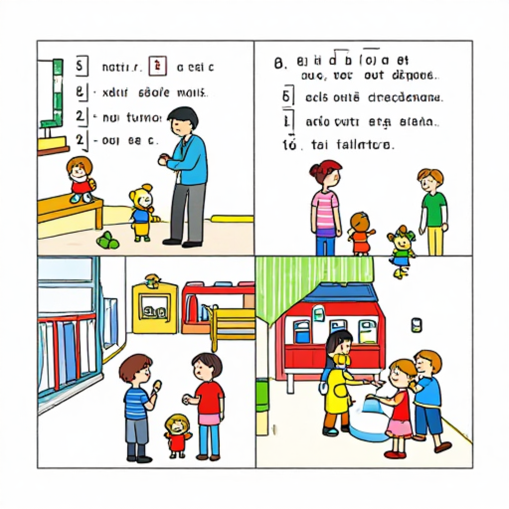
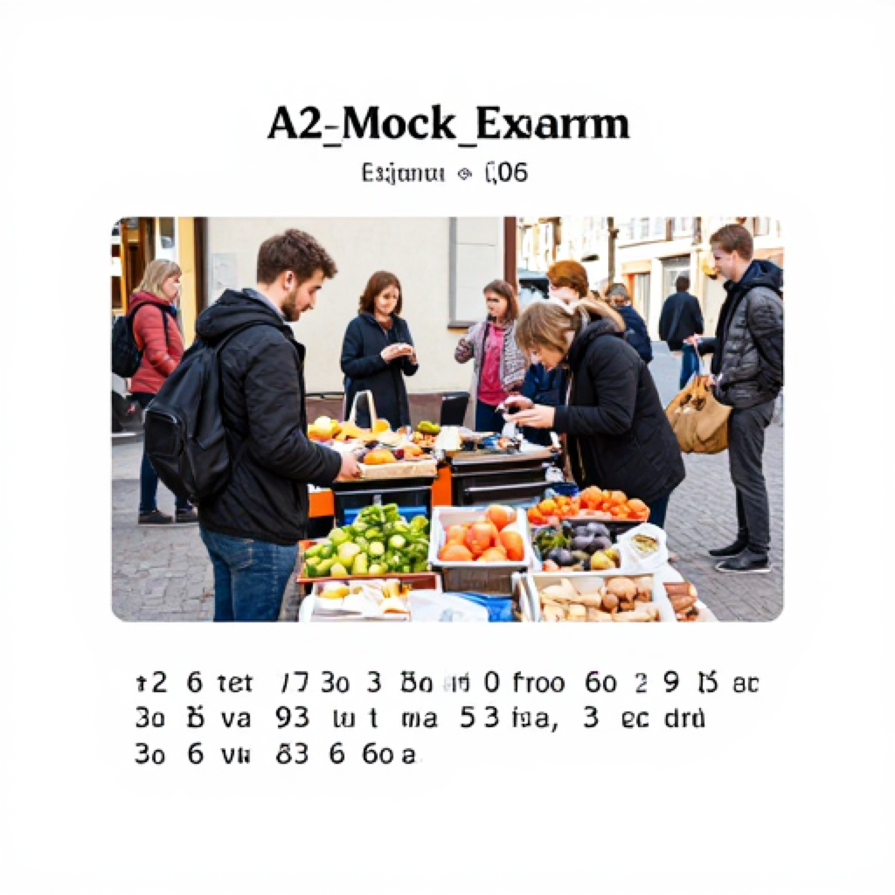
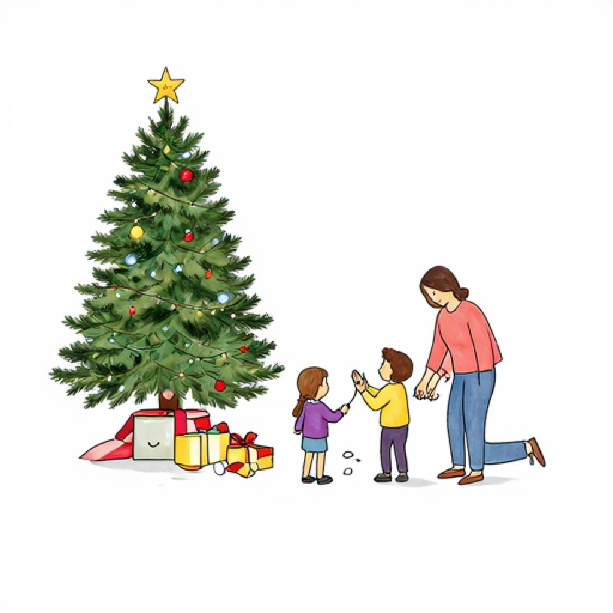

# A2 Mock Exam 06

> Audio attachments in this exam are generated locally with Piper using the Latvian voice `lv_LV-rudolfs-medium`.

## Student Version

Klausīšanās – 15 punkti  
Lasīšana – 15 punkti  
Rakstīšana – 15 punkti  
Runāšana – 15 punkti  
Kopā – 60 punkti  
Lai nokārtotu: vismaz 9 punkti katrā prasmē (minimum 9 points in each skill)

### Klausīšanās prasmes pārbaude

Laiks – 25 minūtes

#### 1. uzdevums

<audio controls preload="none">
  <source src="Attachments/A2_Mock_Exam_06/klausisanas_1_uzdevums.mp3" type="audio/mpeg">
  Your browser does not support the audio element.
</audio>

[Audio failsafe link](Attachments/A2_Mock_Exam_06/klausisanas_1_uzdevums.mp3)

Klausieties paziņojumus! Katrs paziņojums skanēs divas reizes.  
Pēc katra paziņojuma atzīmējiet pareizo atbildi!

1. Cikos sāksies dzimšanas dienas ballīte?
   - a) 17.00
   - b) 18.00
   - c) 19.00
2. Kur notiks Ziemassvētku tirdziņš?
   - a) Pilsētas laukumā
   - b) Skolas zālē
   - c) Sporta centrā
3. Kad var saņemt dāvanu iesaiņošanu bez maksas?
   - a) Tikai sestdien
   - b) Katru darba dienu
   - c) Tikai svētdien
4. Cik maksā koncerta biļete skolēniem?
   - a) 4 eiro
   - b) 5 eiro
   - c) 6 eiro
5. Cikos jāizņem pasūtītā torte?
   - a) 14.00
   - b) 15.00
   - c) 16.00
6. Kas jāņem līdzi uz pikniku?
   - a) Silta jaka
   - b) Dāvana
   - c) Pase

#### 2. uzdevums

<audio controls preload="none">
  <source src="Attachments/A2_Mock_Exam_06/klausisanas_2_uzdevums.mp3" type="audio/mpeg">
  Your browser does not support the audio element.
</audio>

[Audio failsafe link](Attachments/A2_Mock_Exam_06/klausisanas_2_uzdevums.mp3)

Klausieties sarunu! Saruna skanēs divas reizes.  
Atzīmējiet, vai apgalvojums ir pareizs (`Jā`) vai nepareizs (`Nē`)!

1. Linda aicina Juri uz savu vārda dienu.
2. Pasākums notiks kafejnīcā.
3. Juris drīkst atnākt ar sievu.
4. Linda lūdz atnest dāvanas.

#### 3. uzdevums

<audio controls preload="none">
  <source src="Attachments/A2_Mock_Exam_06/klausisanas_3_uzdevums.mp3" type="audio/mpeg">
  Your browser does not support the audio element.
</audio>

[Audio failsafe link](Attachments/A2_Mock_Exam_06/klausisanas_3_uzdevums.mp3)

Klausieties sarunas! Sarunas skanēs divas reizes.  
Ievelciet atbilstošo skaitli vai vārdu! Četras atbildes ir liekas.

1. Svecītes nopirka `_____`.
2. Koncerts sākas pulksten `_____`.
3. Sieviete dāvinās `_____`.
4. Ballītē būs `_____` cilvēki.
5. Viņi satiksies pie mājas `_____`.

Atbilžu varianti: `veikalā`, `18.00`, `ziedus`, `desmit`, `durvīm`, `kino`, `7.00`, `vīram`, `autobusā`

### Lasītprasmes pārbaude

Laiks – 30 minūtes

#### 1. uzdevums

Lasiet tekstu un atzīmējiet, kurš apgalvojums ir pareizs!

**Teksts 1**

Mīļā Anna! Aicinu tevi sestdien, 15. jūnijā, uz manu dzimšanas dienu. Sākums pulksten 17.00 mūsu mājas pagalmā. Būs grils, mūzika un spēles bērniem. Ja laiks būs slikts, svinēsim verandā. Lūdzu, pasaki līdz ceturtdienai, vai varēsi atnākt. Ja gribi, vari ņemt līdzi arī savu māsu. Uz tikšanos! Ieva. Būs arī citronu kūka un limonāde. Pagalmā ir vieta bērnu spēlēm un galdi pieaugušajiem. Tāpēc šī informācija var palīdzēt cilvēkiem iepriekš saplānot dienu, paņemt visas vajadzīgās lietas līdzi, atrast pareizo vietu, laiku un bez steigas izdarīt svarīgo.

- a) Dzimšanas diena sāksies pulksten 17.00.
- b) Pasākums notiks skolā.
- c) Anna nedrīkst nākt ar māsu.

**Teksts 2**

Veikals “Dāvanu stūrītis” piedāvā bezmaksas dāvanu iesaiņošanu visiem pirkumiem virs 20 eiro. Veikalā var nopirkt krūzes, svecītes, foto rāmjus, rotaļlietas un svētku kartītes. Darba dienās veikals ir atvērts no 10.00 līdz 19.00, sestdien no 10.00 līdz 17.00. Svētdienās veikals ir slēgts. Pārdevējas palīdz atrast piemērotu dāvanu dažādiem svētkiem. Pie kases var nopirkt arī lentes un mazas aploksnes naudai. Tāpēc šī informācija var palīdzēt cilvēkiem iepriekš saplānot dienu, paņemt visas vajadzīgās lietas līdzi, atrast pareizo vietu, laiku un bez steigas izdarīt svarīgo.

- a) Veikals svētdien ir atvērts.
- b) Veikalā nevar nopirkt kartītes.
- c) Par pirkumu virs 20 eiro dāvanu iesaiņo bez maksas.

**Teksts 3**

Pagājušajos Ziemassvētkos mēs ar ģimeni palikām mājās. No rīta rotājām eglīti, cepām piparkūkas un klausījāmies dziesmas. Vakarā pie mums atnāca vecvecāki un tante ar bērniem. Mamma gatavoja cepeti, bet es palīdzēju klāt galdu. Pēc vakariņām visi atvērām dāvanas. Mazajam brālim visvairāk patika jaunā koka mašīna. Tie bija mierīgi un jauki svētki. Pēc tam mēs vēl ilgi sēdējām pie galda. Visi stāstīja stāstus par iepriekšējiem svētkiem. Tāpēc šī informācija var palīdzēt cilvēkiem iepriekš saplānot dienu, paņemt visas vajadzīgās lietas līdzi, atrast pareizo vietu, laiku un bez steigas izdarīt svarīgo.

- a) Ģimene Ziemassvētkos brauca uz ārzemēm.
- b) Mazajam brālim patika koka mašīna.
- c) Vecvecāki pie viņiem neatnāca.

**Teksts 4**

Kultūras centrā piektdien notiks pavasara koncerts. Programmā būs koris, bērnu deju grupa un vietējā ansambļa uzstāšanās. Pasākums sāksies pulksten 19.00. Ieeja pieaugušajiem maksā 6 eiro, bet skolēniem un pensionāriem – 4 eiro. Pēc koncerta varēs nopirkt ziedus un suvenīrus foajē. Foajē darbosies arī neliela kafejnīca ar tēju un kūku. Organizatori aicina biļetes nopirkt iepriekš, jo vietu skaits ir ierobežots. Tāpēc šī informācija var palīdzēt cilvēkiem iepriekš saplānot dienu, paņemt visas vajadzīgās lietas līdzi, atrast pareizo vietu, laiku un bez steigas izdarīt svarīgo.

- a) Koncerts sākas pulksten 18.00.
- b) Skolēniem biļete ir lētāka.
- c) Pēc koncerta nevarēs nopirkt ziedus.

#### 2. uzdevums

Atrodiet, kurš sludinājums (A–L) atbilst katrai situācijai!

**Situācijas**

1. Rūtai vajag dzimšanas dienai pasūtīt lielu torti.
2. Jānis grib nopirkt ziedus skolotājai svētkos.
3. Elīna meklē bērnam dāvanu.
4. Pāris vēlas nopirkt biļetes uz svētku koncertu.
5. Mārtiņam vajag iesaiņot jau nopirktu dāvanu.
6. Ģimene grib pasūtīt balonus un telpas rotājumus ballītei.

**Sludinājumi**

- A. Konditoreja cep tortes dzimšanas dienām un jubilejām.
- B. Ziedu veikals piedāvā pušķus skolotājiem un svētkiem.
- C. Rotaļlietu veikalā mašīnas, lelles un spēles bērniem.
- D. Kultūras nama kasē pārdod biļetes uz svētku koncertu.
- E. Dāvanu salons iesaiņo dāvanas dažādos papīros un lentēs.
- F. Pasākumu aģentūra piedāvā balonus un zāles dekorēšanu.
- G. Pārdod sporta apavus ar atlaidi.
- H. Frizētava piedāvā vakara frizūras.
- I. Kafejnīca meklē trauku mazgātāju.
- J. Viesu nams pieņem rezervācijas vasarai.
- K. Remontē telefonus stundas laikā.
- L. Grāmatnīca pārdod kalendārus.

#### 3. uzdevums

Lasiet tekstu un izvēlieties pareizo vārdu!

Šogad mēs nolēmām mammas jubileju svinēt mājās. No rīta sakārtojām istabu un uz galda nolikām puķes. Tētis aizbrauca pakaļ tortei, bet es ar māsu piepūtām **(1)**. Viesi sāka nākt pulksten piecos. Vecmāmiņa uzdāvināja mammai skaistu šalli, bet krustmāte – lielu fotogrāmatu. Visi kopā dzērām tēju, ēdām torti un runājām par ģimenes **(2)**. Vēlāk skanēja mūzika, un mazie bērni dejoja. Mamma teica, ka viņai šī diena ļoti **(3)**. Pirms viesi gāja prom, mēs visiem iedevām pa gabaliņam tortes līdzi uz **(4)**. Vakarā bijām noguruši, bet ļoti **(5)**.

1. - a) balonus
   - b) skapjus
   - c) logus
2. - a) atmiņām
   - b) dakšām
   - c) somām
3. - a) patika
   - b) slīdēja
   - c) maksāja
4. - a) mājām
   - b) galdam
   - c) skolai
5. - a) priecīgi
   - b) plāni
   - c) tumši

### Rakstītprasmes pārbaude

Laiks – 35 minūtes

#### 1. uzdevums

Apskatiet attēlu aprakstus! Uzrakstiet par katru attēlu vienu teikumu. Katrā teikumā ne mazāk par 5 vārdiem.

1. Bērni rotā eglīti viesistabā.
2. Sieviete nes dāvanu uz dzimšanas dienu.
3. Draugi sēž pie svētku galda.
4. Vīrietis pērk ziedus tirgū.

#### 2. uzdevums

Rakstiet iekavās doto vārdu pareizajā formā!

1. Es nopirku skaistu `_____` (dāvana) māsai.
2. Vakar mēs ilgi `_____` (svinēt) jubileju.
3. Es uzrakstīju kartīti `_____` (viņa).
4. Svētku galds bija ļoti `_____` (bagāts).
5. Ballītē bija `_____` (pieci) bērni.

#### 3. uzdevums

Iedomājieties, ka rīkojat dzimšanas dienu. Uzrakstiet īsziņu draugam, kurā:

1. uzaiciniet draugu uz pasākumu;
2. uzrakstiet datumu un laiku;
3. pasakiet, kur svinēsiet;
4. uzrakstiet, ko draugs var atnest vai ko darīsiet kopā.

Teksta apjoms – apmēram 35 vārdi.

### Runātprasmes pārbaude

Laiks – 10–15 minūtes

#### 1. uzdevums

<audio controls preload="none">
  <source src="Attachments/A2_Mock_Exam_06/runasana_1_jautajumi.mp3" type="audio/mpeg">
  Your browser does not support the audio element.
</audio>

[Audio failsafe link](Attachments/A2_Mock_Exam_06/runasana_1_jautajumi.mp3)

Atbildiet uz jautājumiem pilnos teikumos.

1. Kādi svētki jums patīk visvairāk?
2. Kā jūs svinat savu dzimšanas dienu?
3. Vai jums patīk dāvināt dāvanas?
4. Ko jūs parasti dāvināt ģimenei?
5. Vai jūs bieži aicināt viesus mājās?
6. Ko jūs gatavojat svētku galdam?
7. Vai jums patīk koncerti?
8. Kā jūs rotājat māju svētkos?
9. Ko jūs darāt Jaunajā gadā?
10. Vai jums patīk saņemt ziedus vai saldumus? Kāpēc?

#### 2. uzdevums

<audio controls preload="none">
  <source src="Attachments/A2_Mock_Exam_06/runasana_2_jautajumi.mp3" type="audio/mpeg">
  Your browser does not support the audio element.
</audio>

[Audio failsafe link](Attachments/A2_Mock_Exam_06/runasana_2_jautajumi.mp3)

Aplūkojiet attēlu aprakstus! Atbildiet uz jautājumiem par attēliem.

**Attēls A.** Ģimene sēž pie dzimšanas dienas galda un smaida.  
Jautājumi: **Kas? Ko dara? Kur?**

**Attēls B.** Divi bērni Ziemassvētkos atver dāvanas pie egles.  
Jautājumi: **Kas? Ko dara? Kur?**

**Jautājums jums:** Kādus svētkus jums patīk svinēt? Kāpēc?

#### 3. uzdevums

<audio controls preload="none">
  <source src="Attachments/A2_Mock_Exam_06/runasana_3_jautajumi.mp3" type="audio/mpeg">
  Your browser does not support the audio element.
</audio>

[Audio failsafe link](Attachments/A2_Mock_Exam_06/runasana_3_jautajumi.mp3)

Uzdodiet jautājumus! Jautājumus formulējiet pilnā teikumā.

1. Koncerts sāksies pulksten ... ? ...  
   Uzziniet laiku!
2. Torte maksā ... ? ... eiro.  
   Uzziniet cenu!
3. Ballīte notiks ... ? ... ielā 12.  
   Uzziniet ielas nosaukumu!

## Answer Key

### Klausīšanās

**1. uzdevums:** 1.b, 2.a, 3.a, 4.a, 5.b, 6.a  
**2. uzdevums:** 1. Jā, 2. Nē, 3. Jā, 4. Nē  
**3. uzdevums:** 1. veikalā, 2. 18.00, 3. ziedus, 4. desmit, 5. durvīm

### Lasīšana

**1. uzdevums:** 1.a, 2.c, 3.b, 4.b  
**2. uzdevums:** 1.A, 2.B, 3.C, 4.D, 5.E, 6.F  
**3. uzdevums:** 1.a, 2.a, 3.a, 4.a, 5.a

### Rakstīšana

**2. uzdevums:** 1. dāvanu, 2. svinējām, 3. viņai, 4. bagāts, 5. pieci

## Listening Transcripts

### 1. uzdevums

1. paziņojums  
Atgādinām, ka Rūtas dzimšanas dienas ballīte sāksies pulksten astoņpadsmitos.

2. paziņojums  
Ziemassvētku tirdziņš šogad notiks pilsētas laukumā pie strūklakas.

3. paziņojums  
Dāvanu iesaiņošanu bez maksas var saņemt tikai sestdien mūsu veikalā.

4. paziņojums  
Skolēniem biļete uz pavasara koncertu maksā četrus eiro.

5. paziņojums  
Pasūtīto torti lūdzam izņemt pulksten piecpadsmitos konditorejā.

6. paziņojums  
Rītdienas piknikā pie ezera būs vēss, tāpēc neaizmirstiet paņemt līdzi siltu jaku.

### 2. uzdevums

Sarunājas Linda un Juris.

- Sveiks, Juri! Vai tu sestdien vari atnākt uz manu vārda dienu?
- Jā, labprāt. Kur tas notiks?
- Pie manis mājās, nevis kafejnīcā.
- Labi. Vai es drīkstu atnākt kopā ar sievu?
- Protams, nāciet abi!
- Ko atnest?
- Tikai labu garastāvokli. Dāvanas nevajag.
- Tad tiekamies sestdien!

### 3. uzdevums

1. saruna  
- Kur tu nopirki svecītes kūkai?  
- Es tās nopirku veikalā pie mājām.

2. saruna  
- Cikos sākas koncerts?  
- Koncerts sākas pulksten astoņpadsmitos.

3. saruna  
- Ko tu dāvināsi skolotājai?  
- Es dāvināšu ziedus.

4. saruna  
- Cik cilvēku būs ballītē?  
- Domāju, ka būs desmit cilvēki.

5. saruna  
- Kur mēs tiksimies?  
- Tiksimies pie mājas durvīm.

## Writing Model Answers

### 1. uzdevums

Iespējamie teikumi:

1. Bērni viesistabā rotā skaistu eglīti.
2. Sieviete nes dāvanu uz dzimšanas dienu.
3. Draugi svētkos sēž pie galda.
4. Vīrietis tirgū pērk ziedus.

### 2. uzdevums

Pareizās formas: `dāvanu`, `svinējām`, `viņai`, `bagāts`, `pieci`

### 3. uzdevums

Parauga atbilde:

Sveiks! Aicinu tevi uz manu dzimšanas dienu 12. augustā pulksten 17.00. Svinēsim manās mājās. Vari atnest savu mīļāko galda spēli, jo vakarā spēlēsim kopā. Vai tu būsi?

Pārbaudes piezīmes:

- ir uzaicinājums;
- ir datums un laiks;
- ir norādīta vieta;
- ir pateikts, ko draugs var atnest vai ko darīs kopā.

## Speaking Teacher Notes

### 1. uzdevums

Iespējamās atbildes:

1. Man visvairāk patīk Ziemassvētki.
2. Savu dzimšanas dienu es svinu ar ģimeni.
3. Jā, man patīk dāvināt dāvanas.
4. Es ģimenei parasti dāvinu grāmatas vai saldumus.
5. Jā, reizēm es aicinu viesus mājās.
6. Svētku galdam es gatavoju salātus un kūku.
7. Jā, man patīk koncerti.
8. Svētkos es rotāju māju ar svecēm un ziediem.
9. Jaunajā gadā es esmu kopā ar draugiem vai ģimeni.
10. Man patīk saņemt ziedus, jo tie ir skaisti.

### 2. uzdevums

Iespējamās atbildes:

- Attēls A: Attēlā ģimene sēž pie dzimšanas dienas galda. Viņi svin mājās.
- Attēls B: Attēlā bērni atver dāvanas pie egles. Tas notiek Ziemassvētkos mājās.
- Jautājums jums: Man patīk svinēt Ziemassvētkus, jo visa ģimene ir kopā.

### 3. uzdevums

Iespējamie jautājumi:

1. Cikos sāksies koncerts?
2. Cik eiro maksā torte?
3. Kuras ielas 12. namā notiks ballīte?

Skolotāja piezīme: pieņemami ir citi pilni un gramatiski pareizi jautājumi ar tādu pašu nozīmi.
