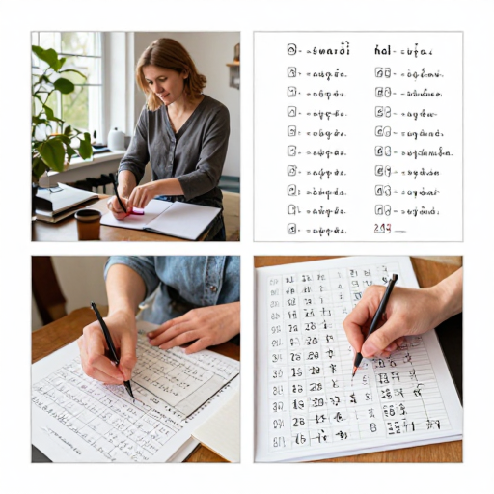
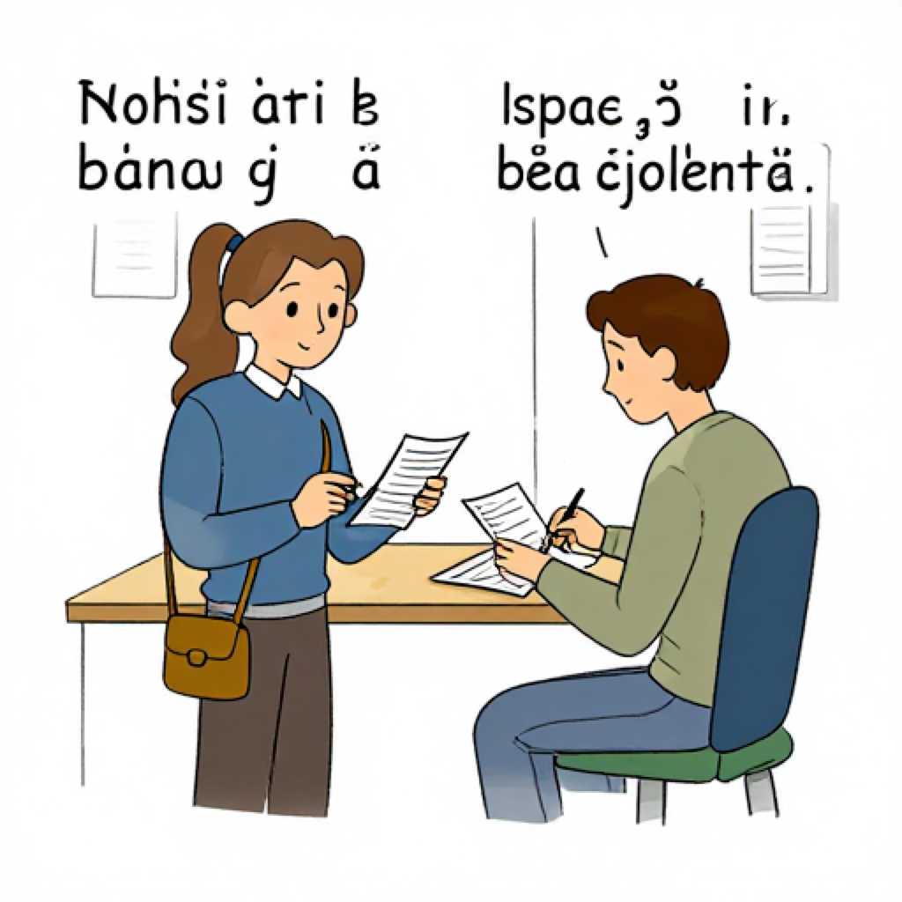
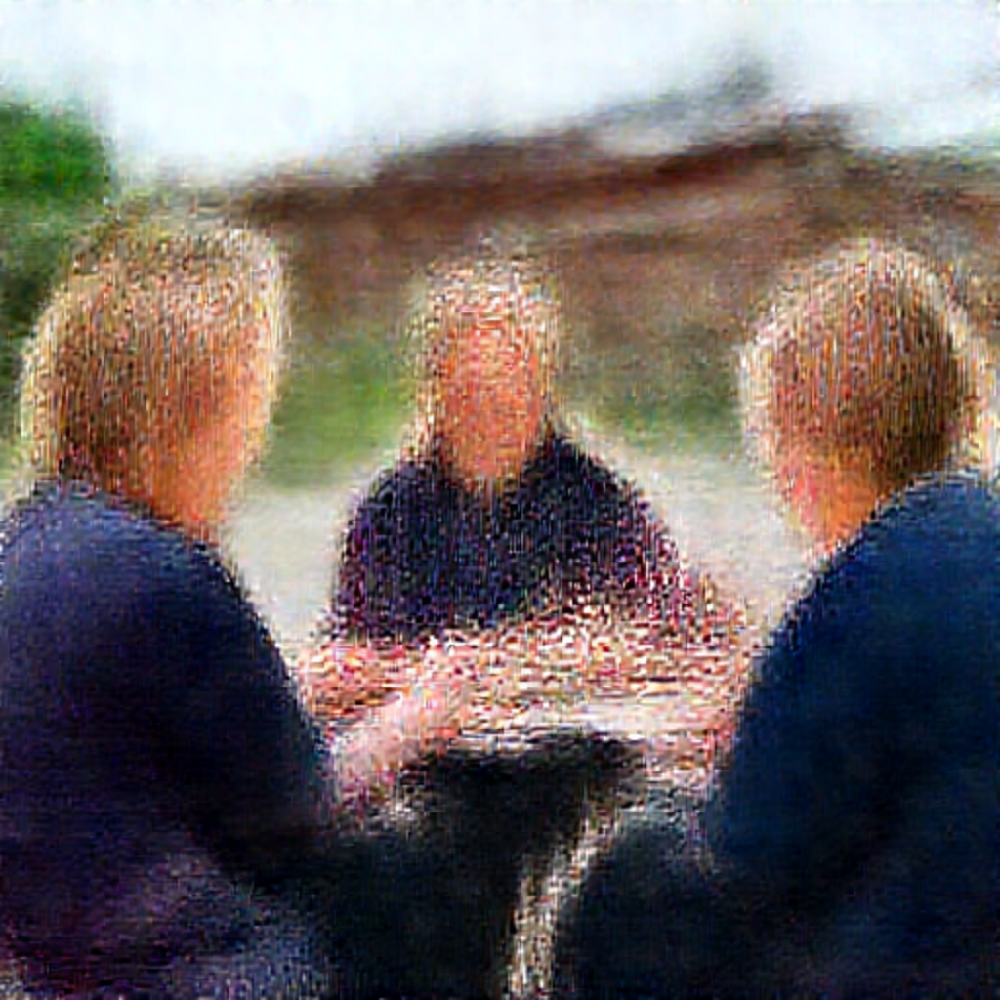

# A2 Mock Exam 08

> Audio attachments in this exam are generated locally with Piper using the Latvian voice `lv_LV-rudolfs-medium`.

## Student Version

Klausīšanās – 15 punkti  
Lasīšana – 15 punkti  
Rakstīšana – 15 punkti  
Runāšana – 15 punkti  
Kopā – 60 punkti  
Lai nokārtotu: vismaz 9 punkti katrā prasmē (minimum 9 points in each skill)

### Klausīšanās prasmes pārbaude

Laiks – 25 minūtes

#### 1. uzdevums

<audio controls preload="none">
  <source src="Attachments/A2_Mock_Exam_08/klausisanas_1_uzdevums.mp3" type="audio/mpeg">
  Your browser does not support the audio element.
</audio>

[Audio failsafe link](Attachments/A2_Mock_Exam_08/klausisanas_1_uzdevums.mp3)

Klausieties paziņojumus! Katrs paziņojums skanēs divas reizes.  
Pēc katra paziņojuma atzīmējiet pareizo atbildi!

1. Līdz cikiem šodien strādā pasts?
   - a) Līdz 17.00
   - b) Līdz 18.00
   - c) Līdz 19.00
2. Kur jāsaņem jaunā bankas karte?
   - a) 3. logā
   - b) 5. logā
   - c) 7. logā
3. Kur atrodas apavu remonts?
   - a) Pie tirgus
   - b) Pie stacijas
   - c) Pie aptiekas
4. Kad pienāks kurjers?
   - a) No 10.00 līdz 12.00
   - b) No 12.00 līdz 14.00
   - c) No 14.00 līdz 16.00
5. Cikos ir pieraksts pie frizieres?
   - a) 11.00
   - b) 12.00
   - c) 13.00
6. Cik maksā telefona ekrāna remonts?
   - a) 20 eiro
   - b) 25 eiro
   - c) 30 eiro

#### 2. uzdevums

<audio controls preload="none">
  <source src="Attachments/A2_Mock_Exam_08/klausisanas_2_uzdevums.mp3" type="audio/mpeg">
  Your browser does not support the audio element.
</audio>

[Audio failsafe link](Attachments/A2_Mock_Exam_08/klausisanas_2_uzdevums.mp3)

Klausieties sarunu! Saruna skanēs divas reizes.  
Atzīmējiet, vai apgalvojums ir pareizs (`Jā`) vai nepareizs (`Nē`)!

1. Olga grib atvērt bankas kontu.
2. Viņai nav pases.
3. Konta atvēršana maksā 10 eiro.
4. Karte būs gatava pēc nedēļas.

#### 3. uzdevums

<audio controls preload="none">
  <source src="Attachments/A2_Mock_Exam_08/klausisanas_3_uzdevums.mp3" type="audio/mpeg">
  Your browser does not support the audio element.
</audio>

[Audio failsafe link](Attachments/A2_Mock_Exam_08/klausisanas_3_uzdevums.mp3)

Klausieties sarunas! Sarunas skanēs divas reizes.  
Ievelciet atbilstošo skaitli vai vārdu! Četras atbildes ir liekas.

1. Sūtījums atrodas `_____`.
2. Friziere pieņems pulksten `_____`.
3. Meistars labo `_____`.
4. Klients samaksāja `_____`.
5. Sieviete rakstīs `_____`.

Atbilžu varianti: `pakomātā`, `11.00`, `televizoru`, `20 eiro`, `iesniegumu`, `zupu`, `18.00`, `pastniekam`, `kurpes`

### Lasītprasmes pārbaude

Laiks – 30 minūtes

#### 1. uzdevums

Lasiet tekstu un atzīmējiet, kurš apgalvojums ir pareizs!

**Teksts 1**

Pasta nodaļa informē, ka no jūnija mainās darba laiks. Darba dienās pasts būs atvērts no 9.00 līdz 18.00, bet sestdienās – no 10.00 līdz 14.00. Pasts pieņem vēstules, pakas un rēķinu maksājumus. Sūtījumus no ārzemēm var saņemt ar pasi vai ID karti. Ja saņemat īsziņu no pakomāta, sūtījumu varat izņemt jebkurā laikā. Nodaļā ir arī galds, kur var aizpildīt veidlapas. Darbinieki palīdz cilvēkiem, kuri pirmo reizi sūta paku. Tāpēc šī informācija var palīdzēt cilvēkiem iepriekš saplānot dienu, paņemt visas vajadzīgās lietas līdzi, atrast pareizo vietu, laiku un bez steigas izdarīt svarīgo.

- a) Darba dienās pasts būs atvērts līdz 18.00.
- b) Sestdienās pasts būs slēgts.
- c) Sūtījumus no ārzemēm nevar saņemt ar ID karti.

**Teksts 2**

Sveiks, tēti! Šodien aizvedu telefonu uz remontu, jo ekrāns pēc kritiena saplīsa. Meistars teica, ka remonts maksās 25 eiro un būs gatavs rīt pēcpusdienā. Kamēr gaidīju, es arī aizgāju uz banku un samaksāju internetu. Vēlāk iegriezos pastā, lai nosūtītu dokumentus. Diena bija gara, bet visu paspēju. Marta. Servisā bija daudz klientu, tāpēc gaidīju apmēram pusstundu. Toties meistars visu skaidri izstāstīja un iedeva čeku. Tāpēc šī informācija var palīdzēt cilvēkiem iepriekš saplānot dienu, paņemt visas vajadzīgās lietas līdzi, atrast pareizo vietu, laiku un bez steigas izdarīt svarīgo.

- a) Marta remontēja datoru.
- b) Telefona remonts maksās 25 eiro.
- c) Marta neko nepaspēja izdarīt.

**Teksts 3**

Mūsu mājā šonedēļ strādā santehniķis. Viņš pārbaudīs virtuves caurules un nomainīs veco krānu vannasistabā. Darbi notiks ceturtdien no 10.00 līdz 13.00. Lūdzam šajā laikā būt mājās vai atstāt atslēgu pie kaimiņienes 12. dzīvoklī. Ja ir jautājumi, zvaniet mājas vecākajam. Pēc darbu beigām meistars pārbaudīs, vai viss darbojas pareizi. Lūdzam gaitenī neatstāt somas un bērnu ratus. Tāpēc šī informācija var palīdzēt cilvēkiem iepriekš saplānot dienu, paņemt visas vajadzīgās lietas līdzi, atrast pareizo vietu, laiku un bez steigas izdarīt svarīgo.

- a) Santehniķis nāks piektdien vakarā.
- b) Darbi notiks trīs stundas.
- c) Atslēgu var atstāt pie kaimiņa 21. dzīvoklī.

**Teksts 4**

Artis strādā klientu apkalpošanas centrā. Viņš palīdz cilvēkiem aizpildīt iesniegumus, izdrukā dokumentus un paskaidro, kur jāmaksā rēķini. Daudzi klienti ir vecāki cilvēki, tāpēc Artis runā lēni un skaidri. Dažreiz darbs ir nogurdinošs, bet viņam patīk palīdzēt, jo pēc sarunas cilvēki jūtas mierīgāki un saprot, ko darīt tālāk. Katru dienu viņam jābūt pacietīgam un uzmanīgam. Kolēģi saka, ka Artis labi prot visu mierīgi paskaidrot. Tāpēc šī informācija var palīdzēt cilvēkiem iepriekš saplānot dienu, paņemt visas vajadzīgās lietas līdzi, atrast pareizo vietu, laiku un bez steigas izdarīt svarīgo.

- a) Artis strādā auto servisā.
- b) Viņš palīdz cilvēkiem ar dokumentiem.
- c) Viņam nepatīk palīdzēt klientiem.

#### 2. uzdevums

Atrodiet, kurš sludinājums (A–L) atbilst katrai situācijai!

**Situācijas**

1. Viktoram jāsalabo mašīnas bremzes.
2. Annai vajag nosūtīt paku uz Lietuvu.
3. Ilzei jāpārgriež mati pie friziera.
4. Rihards grib salabot telefonu.
5. Dacei jāatver bankas konts.
6. Jānim vajag atslēgu dublikātu.

**Sludinājumi**

- A. Auto servisā labo bremzes, riepas un motorus.
- B. Pasts sūta pakas uz Latviju un ārzemēm.
- C. Frizētava pieņem klientus ar pierakstu.
- D. Telefonu servisā maina ekrānus un baterijas.
- E. Bankas filiāle palīdz atvērt kontu un izņemt karti.
- F. Atslēgu darbnīca izgatavo dublikātus 15 minūtēs.
- G. Veikals pārdod putekļsūcējus.
- H. Kafejnīca piedāvā brokastis.
- I. Sporta zāle meklē treneri.
- J. Pārdod bērnu galdu.
- K. Muzejs piedāvā ekskursijas.
- L. Grāmatnīca pārdod vārdnīcas.

#### 3. uzdevums

Lasiet tekstu un izvēlieties pareizo vārdu!

Šorīt man vajadzēja izdarīt vairākas lietas pilsētā. Vispirms es aizgāju uz banku, lai samaksātu rēķinus un saņemtu jauno **(1)**. Pēc tam devos uz pastu, kur nosūtīju dokumentus brālim uz ārzemēm. Tā kā manām kurpēm bija nolūzis papēdis, es iegāju arī apavu remontā. Meistars teica, ka kurpes būs gatavas nākamajā **(2)**. Vēlāk satiku draudzeni, un mēs kopā iedzērām kafiju. Pa ceļam uz mājām es saņēmu īsziņu, ka paka jau ir **(3)**. Man patīk, ja visus darbus varu izdarīt vienā dienā, jo tad vakarā jūtos **(4)**. Rīt man vēl jāuzraksta īss **(5)** klientu centram.

1. - a) karti
   - b) zupu
   - c) segu
2. - a) dienā
   - b) dakšā
   - c) upē
3. - a) pakomātā
   - b) klasē
   - c) plauktā
4. - a) mierīgi
   - b) sarkans
   - c) dziļi
5. - a) iesniegums
   - b) lietus
   - c) zieds

### Rakstītprasmes pārbaude

Laiks – 35 minūtes

#### 1. uzdevums

Apskatiet attēlu aprakstus! Uzrakstiet par katru attēlu vienu teikumu. Katrā teikumā ne mazāk par 5 vārdiem.

1. Sieviete stāv pie pasta loga ar paku.
2. Vīrietis bankā runā ar konsultanti.
3. Meistars darbnīcā labo telefonu.
4. Kliente sēž frizētavā pie spoguļa.

#### 2. uzdevums

Rakstiet iekavās doto vārdu pareizajā formā!

1. Es nosūtīju `_____` (paka) draudzenei.
2. Rīt es gribu `_____` (salabot) telefonu.
3. Darbiniece paskaidroja `_____` (viņš), kur jāmaksā.
4. Friziere bija ļoti `_____` (laipns).
5. Bankā bija `_____` (četri) klienti rindā.

#### 3. uzdevums

Iedomājieties, ka jūsu telefons ir salūzis. Uzrakstiet e-pastu servisam, kurā:

1. pasakiet, kas noticis ar telefonu;
2. pajautājiet par remonta cenu;
3. pajautājiet, kad telefons būs gatavs;
4. uzrakstiet savu tālruņa numuru saziņai.

Teksta apjoms – apmēram 35 vārdi.

### Runātprasmes pārbaude

Laiks – 10–15 minūtes

#### 1. uzdevums

<audio controls preload="none">
  <source src="Attachments/A2_Mock_Exam_08/runasana_1_jautajumi.mp3" type="audio/mpeg">
  Your browser does not support the audio element.
</audio>

[Audio failsafe link](Attachments/A2_Mock_Exam_08/runasana_1_jautajumi.mp3)

Atbildiet uz jautājumiem pilnos teikumos.

1. Cik bieži jūs ejat uz banku?
2. Vai jūs lietojat pakomātus?
3. Ko jūs darāt, ja kaut kas mājās salūst?
4. Vai jums patīk iet pie friziera?
5. Kur jūs maksājat rēķinus?
6. Vai jūs bieži sūtāt pakas?
7. Kādu servisu jūs izmantojat visbiežāk?
8. Vai jūs protat aizpildīt iesniegumu?
9. Kam jūs zvanāt, ja vajag remontu?
10. Vai jums patīk ātri apkalpošanas centri? Kāpēc?

#### 2. uzdevums

<audio controls preload="none">
  <source src="Attachments/A2_Mock_Exam_08/runasana_2_jautajumi.mp3" type="audio/mpeg">
  Your browser does not support the audio element.
</audio>

[Audio failsafe link](Attachments/A2_Mock_Exam_08/runasana_2_jautajumi.mp3)

Aplūkojiet attēlu aprakstus! Atbildiet uz jautājumiem par attēliem.

**Attēls A.** Vīrietis pakomātā izņem sūtījumu.  
Jautājumi: **Kas? Ko dara? Kur?**

**Attēls B.** Sieviete auto servisā runā ar meistaru.  
Jautājumi: **Kas? Ko dara? Kur?**

**Jautājums jums:** Kādu pakalpojumu jūs izmantojat visbiežāk?

#### 3. uzdevums

<audio controls preload="none">
  <source src="Attachments/A2_Mock_Exam_08/runasana_3_jautajumi.mp3" type="audio/mpeg">
  Your browser does not support the audio element.
</audio>

[Audio failsafe link](Attachments/A2_Mock_Exam_08/runasana_3_jautajumi.mp3)

Uzdodiet jautājumus! Jautājumus formulējiet pilnā teikumā.

1. Auto remonta cena ir ... ? ... eiro.  
   Uzziniet cenu!
2. Pasts strādā līdz ... ? ...  
   Uzziniet laiku!
3. Bankas filiāle atrodas ... ? ... ielā 20.  
   Uzziniet ielas nosaukumu!

## Answer Key

### Klausīšanās

**1. uzdevums:** 1.b, 2.a, 3.b, 4.b, 5.a, 6.b  
**2. uzdevums:** 1. Jā, 2. Nē, 3. Nē, 4. Jā  
**3. uzdevums:** 1. pakomātā, 2. 11.00, 3. televizoru, 4. 20 eiro, 5. iesniegumu

### Lasīšana

**1. uzdevums:** 1.a, 2.b, 3.b, 4.b  
**2. uzdevums:** 1.A, 2.B, 3.C, 4.D, 5.E, 6.F  
**3. uzdevums:** 1.a, 2.a, 3.a, 4.a, 5.a

### Rakstīšana

**2. uzdevums:** 1. paku, 2. salabot, 3. viņam, 4. laipna, 5. četri

## Listening Transcripts

### 1. uzdevums

1. paziņojums  
Pasts šodien strādā līdz pulksten astoņpadsmitiem.

2. paziņojums  
Jauno bankas karti var saņemt trešajā logā pie klientu apkalpošanas.

3. paziņojums  
Apavu remonts tagad atrodas pie stacijas, blakus kioskam.

4. paziņojums  
Kurjers pie jums atbrauks no pulksten divpadsmitiem līdz četrpadsmitiem.

5. paziņojums  
Jūsu pieraksts pie frizieres ir rīt pulksten vienpadsmitos.

6. paziņojums  
Telefona ekrāna remonts maksās divdesmit piecus eiro.

### 2. uzdevums

Sarunājas kliente un bankas darbiniece.

- Labdien! Es gribu atvērt bankas kontu.
- Protams. Vai jums ir pase vai ID karte?
- Jā, pase man ir līdzi.
- Labi. Konta atvēršana ir bez maksas.
- Cik ātri es saņemšu karti?
- Karte būs gatava pēc nedēļas.
- Paldies, tas man der.

### 3. uzdevums

1. saruna  
- Kur ir mans sūtījums?  
- Tas jau atrodas pakomātā pie veikala.

2. saruna  
- Cikos friziere mani pieņems?  
- Viņa jūs pieņems pulksten vienpadsmitos.

3. saruna  
- Ko meistars tagad labo?  
- Viņš labo televizoru.

4. saruna  
- Cik klients samaksāja par remontu?  
- Viņš samaksāja divdesmit eiro.

5. saruna  
- Ko sieviete rakstīs klientu centrā?  
- Viņa rakstīs iesniegumu.

## Writing Model Answers

### 1. uzdevums

Iespējamie teikumi:

1. Sieviete stāv pie pasta loga ar paku.
2. Vīrietis bankā runā ar konsultanti.
3. Meistars darbnīcā labo telefonu.
4. Kliente frizētavā sēž pie spoguļa.

### 2. uzdevums

Pareizās formas: `paku`, `salabot`, `viņam`, `laipna`, `četri`

### 3. uzdevums

Parauga atbilde:

Labdien! Mans telefons nokrita zemē, un ekrāns vairs nedarbojas. Cik maksā remonts? Kad telefons būs gatavs? Mans tālruņa numurs ir 29123456. Paldies!

Pārbaudes piezīmes:

- ir paskaidrota problēma;
- ir jautājums par cenu;
- ir jautājums par gatavības laiku;
- ir dots tālruņa numurs.

## Speaking Teacher Notes

### 1. uzdevums

Iespējamās atbildes:

1. Uz banku es eju reti.
2. Jā, es lietoju pakomātus.
3. Ja kaut kas salūst, es saucu meistaru.
4. Jā, man patīk iet pie friziera.
5. Rēķinus es maksāju internetbankā.
6. Pakas es sūtu dažreiz.
7. Visbiežāk es izmantoju pakomātu.
8. Jā, es protu aizpildīt iesniegumu.
9. Ja vajag remontu, es zvanu servisam.
10. Jā, man patīk ātra apkalpošana, jo tā taupa laiku.

### 2. uzdevums

Iespējamās atbildes:

- Attēls A: Attēlā vīrietis izņem sūtījumu pakomātā. Viņš stāv ārā pie veikala.
- Attēls B: Attēlā sieviete runā ar meistaru auto servisā. Viņa jautā par remontu.
- Jautājums jums: Visbiežāk es izmantoju pakomātu un internetbanku.

### 3. uzdevums

Iespējamie jautājumi:

1. Cik eiro ir auto remonta cena?
2. Līdz cikiem strādā pasts?
3. Kuras ielas 20. namā atrodas bankas filiāle?

Skolotāja piezīme: pieņemami ir citi pilni un gramatiski pareizi jautājumi ar tādu pašu nozīmi.
