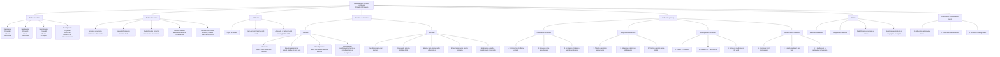

# A2 Limenis Diagram

This Mermaid diagram summarizes the structure of `a_2_limenis (2).pdf`.

```mermaid
flowchart TD
    A["Valsts valodas prasmes parbaude<br/>Pamata (A2) limenis"] --> B["Parbaudes dalas"]
    A --> C["Parbaudes norise"]
    A --> D["Vertējums"]
    A --> E["Prasibas un tematika"]
    A --> F["Uzdevumu paraugi"]
    A --> G["Atbildes"]
    A --> H["Klausisanas audioieraksta teksti"]

    B --> B1["Klausisanas<br/>15 punkti<br/>25 min<br/>Elektroniski"]
    B --> B2["Lasitprasme<br/>15 punkti<br/>30 min<br/>Elektroniski"]
    B --> B3["Rakstitprasme<br/>15 punkti<br/>35 min<br/>Uz papira"]
    B --> B4["Runatprasme<br/>15 punkti<br/>10-15 min<br/>Klātienē vai videokonference"]

    C --> C1["Ierasties ar personu apliecinosu dokumentu"]
    C --> C2["Sanemt informacijas sistemas kodu"]
    C --> C3["Autentificeties sistemā klausisanai un lasisanai"]
    C --> C4["Pec tam sanemt rakstisanas lapas un noradit kodu"]
    C --> C5["Runatprasme notiek atseviski, uzradot dokumentu velreiz"]

    D --> D1["Kopa: 60 punkti"]
    D --> D2["Katra prasmē minimums: 9 punkti"]
    D --> D3["A2 ieguts, ja katra prasmē sasniegti 60%-100%"]

    E --> E1["Prasibas"]
    E --> E2["Tematika"]

    E1 --> E11["Lasitprasme:<br/>saprot issus vienkarsus tekstus"]
    E1 --> E12["Klausisanas prasme:<br/>saprot skaidru un lenu runu"]
    E1 --> E13["Rakstitprasme:<br/>raksta isus tekstus ikdienas tematos"]
    E1 --> E14["Runatprasme:<br/>sniedz isu informaciju un uzdod vienkarsus jautajumus"]

    E2 --> E21["Pamatinformacija par personu"]
    E2 --> E22["Dzivesvieta, gimene, izglitiba, darbs"]
    E2 --> E23["Ikdiena, laiks, majas darbi, edienreizes"]
    E2 --> E24["Brivais laiks, svetki, sports, celošana"]
    E2 --> E25["Iepirksanas, veseliba, pakalpojumi, transports"]

    F --> F1["Klausisanas uzdevumi"]
    F --> F2["Lasitprasmes uzdevumi"]
    F --> F3["Rakstitprasmes uzdevumi"]
    F --> F4["Runatprasmes uzdevumi"]

    F1 --> F11["1. Pazinojumi + 3 atbilzu varianti"]
    F1 --> F12["2. Saruna + ja/ne apgalvojumi"]
    F1 --> F13["3. Isi dialogi + trukstoso vardu ievietosana"]

    F2 --> F21["1. Teksti + pareizais apgalvojums"]
    F2 --> F22["2. Situacijas + atbilstoss sludinajums"]
    F2 --> F23["3. Teksts + pareizā varda izvēle"]

    F3 --> F31["1. 4 atteli -> 4 teikumi"]
    F3 --> F32["2. 5 teikumi -> 5 vardformas"]
    F3 --> F33["3. Iszina vai sludinajums ~35 vardi"]

    F4 --> F41["1. Intervija ar 9-10 jautajumiem"]
    F4 --> F42["2. 2 atteli + jautajumi par tiem"]
    F4 --> F43["3. 3 sludinajumi -> jautajumu formulesana"]

    G --> G1["Klausisanas atbildes"]
    G --> G2["Lasitprasmes atbildes"]
    G --> G3["Rakstitprasmes paraugi un formas"]
    G --> G4["Runatprasmes kriteriji un iespejamie jautajumi"]

    H --> H1["1. uzdevuma pazinojumu teksti"]
    H --> H2["2. uzdevuma sarunas teksts"]
    H --> H3["3. uzdevuma dialogu teksti"]
```
