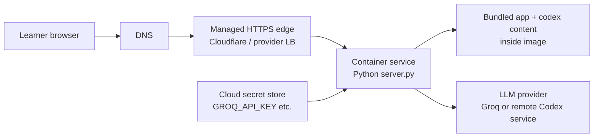
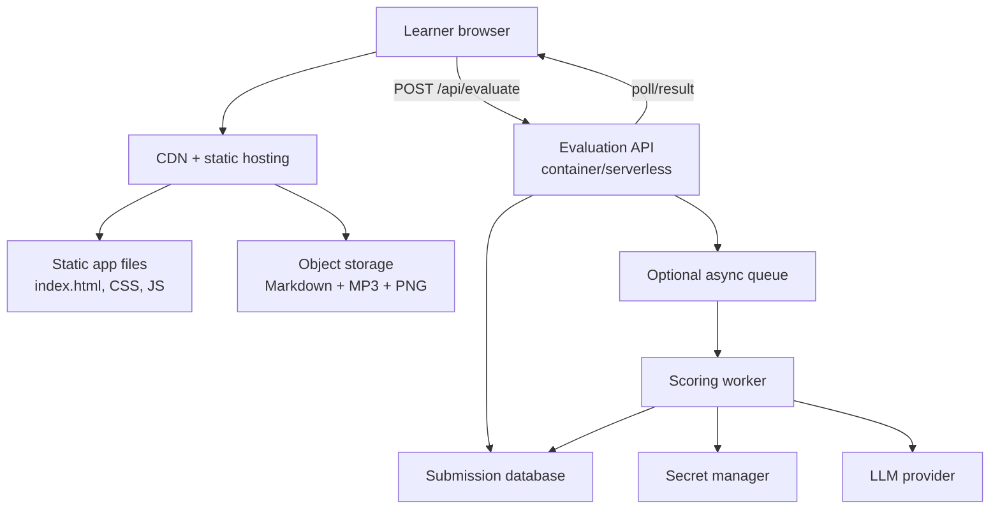
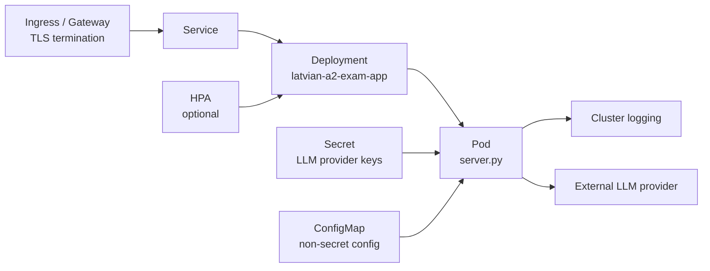
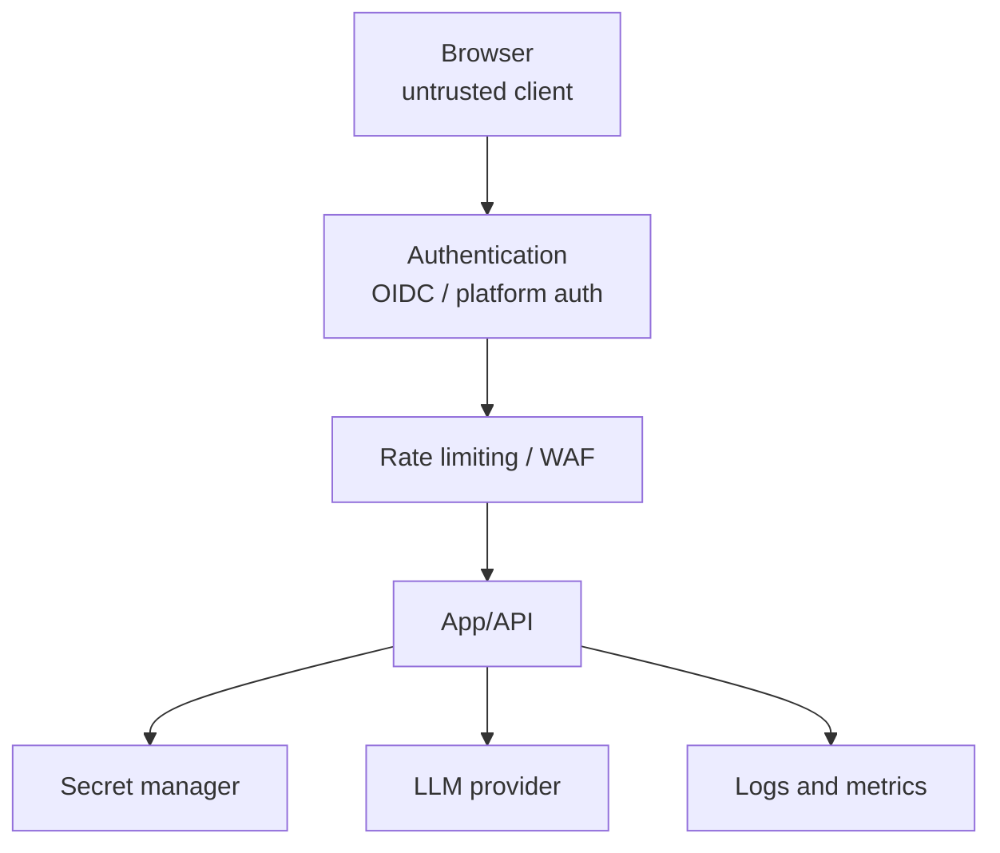
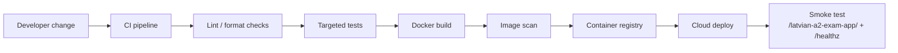

# Cloud Hosting and Improvement Architecture

## Goal

This document describes practical cloud hosting options for Latvian A2 Exam Studio and highlights improvements that would make the solution safer, more reliable, and easier to operate as usage grows.

The solution can start as a single container and evolve into a managed, observable, authenticated service without changing the learner-facing exam experience.

## Recommended Starting Architecture

For the current codebase, the simplest production-like hosting model is one container running `server.py` behind HTTPS. Static files, Markdown content, media attachments, and `/api/evaluate` are served from the same origin.



This fits platforms such as:

- Render Web Service.
- Fly.io app.
- Google Cloud Run.
- AWS App Runner.
- Azure Container Apps.
- Railway or similar container platforms.
- Kubernetes, if an existing cluster already exists.

For this repository, a managed container platform is usually the best first step because it avoids operating Kubernetes for a small app.

## Hosting Options

| Option | Fit | Advantages | Trade-offs |
| --- | --- | --- | --- |
| Single managed container | Best first production path | Low ops burden, keeps `/api/evaluate`, simple secrets | Image includes all exam media; scale is coarse-grained. |
| Static hosting plus serverless API | Good medium-term path | CDN-friendly static app, API can scale separately | Requires path/CORS design and packaging split. |
| Kubernetes | Good only if a cluster already exists | Strong platform controls, GitOps, network policy | More operational overhead than the app currently needs. |
| Local host plus tunnel/VPN | Good private demo path | Fast and cheap | Not durable; weak production posture. |

## Single-Container Cloud Deployment

The current Docker image is ready for this model:

- Container listens on `PORT`, defaulting to `80` in Docker.
- Health check requests `/latvian-a2-exam-app/`.
- Runtime secrets are supplied through environment variables.
- The app, Markdown, and attachments are copied into the image.

Minimal runtime variables for Groq:

```sh
LLM_PROVIDER=groq
GROQ_API_KEY=<secret-from-cloud-secret-store>
LLM_MODEL=llama-3.3-70b-versatile
```

Minimal runtime variables for remote Codex scoring:

```sh
LLM_PROVIDER=codex
CODEX_REMOTE_URL=https://<scoring-service>/api/evaluate
CODEX_MODEL=gpt-5.2
CODEX_TIMEOUT_SECONDS=300
```

Do not bake these variables into the Docker image. Use the hosting platform secret manager or encrypted environment configuration.

## Split Static and API Architecture

Once traffic or deployment cadence grows, split the static content from the evaluation API.



This architecture makes sense when:

- Static files should be cached globally.
- Exam content should update without rebuilding the API container.
- LLM scoring needs async retries or longer execution time.
- Teachers need durable access to submissions and scores.
- Authentication, audit, and data retention requirements appear.

## Kubernetes Reference Architecture

If deploying into an existing Kubernetes platform, keep the setup small and explicit.



Recommended Kubernetes defaults:

- Run at least two replicas if real users depend on the app.
- Add CPU and memory requests/limits after measuring local usage.
- Keep secrets in Kubernetes Secrets backed by an external secret manager if available.
- Use read-only root filesystem if the app no longer needs runtime writes.
- Add NetworkPolicy to allow outbound traffic only to required LLM endpoints if the cluster enforces it.
- Use an ingress controller or gateway with HTTPS, request size limits, and rate limiting.

Rollout behavior risk: multiple replicas are safe for serving static content and evaluation, but the in-memory evaluation cache is per pod. That affects efficiency only, not correctness.

## Security Architecture

Cloud hosting changes the threat model. The current app is suitable for trusted local or internal use, but public hosting should add controls.



Recommended controls:

- Put authentication in front of the app before public release.
- Rate-limit `/api/evaluate` because every request can trigger provider cost.
- Add request validation that checks exam ID, expected answer shape, and maximum text lengths.
- Keep provider keys in a cloud secret manager.
- Avoid logging raw candidate answers.
- Add a privacy note if real learners use the system.
- Consider data residency requirements if storing submissions later.

## Observability and Operations

Minimum cloud telemetry:

- Request count, error count, and latency for `/api/evaluate`.
- LLM provider status codes and retry counts.
- Evaluation duration and timeout counts.
- Container CPU and memory.
- Health check success rate.
- Deployment version or image digest in logs.

Useful alerts:

- High `/api/evaluate` error rate.
- Provider 429/rate-limit spikes.
- Evaluation timeout spikes.
- Container restart loop.
- Unusual request volume.

## Improvement Roadmap

### Near-Term Improvements

1. Add docs for environment variables and provider modes at the repository root.
2. Add a generated exam manifest JSON to reduce fragile runtime Markdown parsing.
3. Add targeted tests for answer-key extraction, submission building, and server provider configuration.
4. Keep structured logging in `server.py` and ship the logs to the platform or Sentry.
5. Keep a simple `/healthz` endpoint separate from static HTML serving.
6. Add frontend request guards for very long free-text answers before evaluation.

### Medium-Term Improvements

1. Split static content from the API so the frontend can be CDN-hosted.
2. Store submissions and evaluations in a database when teacher review or cross-device history is required.
3. Move LLM scoring to an async job queue for retries, long-running provider calls, and better user feedback.
4. Add authentication with OIDC or platform-managed access control.
5. Add admin/teacher review pages with human override of AI scoring.
6. Add versioned exam content so submissions can always be traced to the exact exam revision.

### Long-Term Improvements

1. Introduce a typed content model for exams, generated from Markdown or authored directly.
2. Add localization controls for Latvian/English UI labels.
3. Add analytics for skill-level learner progress.
4. Add rubrics and calibration datasets to evaluate scoring consistency.
5. Add multi-provider LLM fallback and cost controls.
6. Add CI/CD with automated image build, vulnerability scanning, and smoke tests.

## CI/CD Architecture



Recommended first CI checks:

- Validate Python syntax for `server.py` and scripts.
- Run unit tests once added for Markdown parsing and provider config.
- Build the Docker image.
- Run the container and smoke-test the app URL.
- Keep provider-backed LLM calls out of default CI unless mocked.

## Cost Considerations

Primary cost drivers:

- LLM scoring requests.
- Container runtime.
- Egress for media assets if public and high-traffic.
- Optional database and object storage if introduced.

Cost controls:

- Cache identical evaluations.
- Rate-limit scoring.
- Keep media behind CDN caching.
- Use async scoring with quotas for authenticated users.
- Keep generated image/audio tooling out of runtime.

## Recommended Path

Start with a managed container deployment using the current Dockerfile and Groq provider mode. Add authentication and rate limiting if anyone outside a trusted group can access it.

Next, keep tests, structured logs, and `/healthz` covered by smoke checks. Once content updates become frequent or user history matters, split static hosting from the API and introduce persistent storage.

Kubernetes is a good target only if there is already a cluster, GitOps workflow, and operations ownership. Otherwise, managed containers give the best balance of safety, cost, and maintainability for this app.
