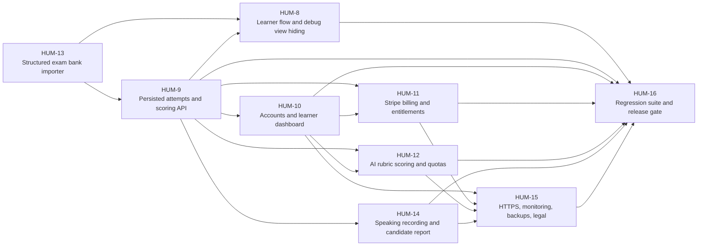

# MVP Dependency Map

## Purpose

This map shows which MVP issues must land first, which can run in parallel, and which are release blockers for the Latvian A2 exam product.

## Dependency Graph

## Sequencing Constraints

- Exam structure must be stable before durable attempt storage is considered finished.
- Attempt history must exist before dashboard analytics can show real cross-device progress.
- Auth must exist before paid entitlements can be enforced reliably.
- Payments must be enforced server-side, not only hidden in the browser.
- AI scoring must sit behind persistence, quotas, and retry handling so costs are bounded.
- Operations work must include secrets, HTTPS, monitoring, and legal pages before public launch.
- QA release gating must run after the core flows and the deployment contract are complete.

## Why Each Dependency Exists

| Dependency | Why it matters | Risk if skipped | Mitigation |
| --- | --- | --- | --- |
| `HUM-13 -> HUM-9` | Backend needs stable exam structure and versioning. | Attempts become hard to reproduce after content changes. | Freeze exam revisions and import to a structured format first. |
| `HUM-9 -> HUM-10` | Dashboard data comes from stored attempts. | Dashboard shows empty or inconsistent history. | Mock attempt data until the API is live. |
| `HUM-10 -> HUM-11` | Entitlements belong to authenticated learners. | Billing and access control are hard to audit. | Require sign-in before checkout and webhook reconciliation. |
| `HUM-9 -> HUM-12` | Scoring needs persisted attempts and a stable record. | AI results are not traceable or retry-safe. | Store prompt/rubric/model versions with each scoring run. |
| `HUM-8 -> HUM-14` | Candidate report must match the learner flow. | Speaking review feels disconnected from the exam experience. | Share one canonical attempt model across both screens. |
| `HUM-9, HUM-10, HUM-11, HUM-12, HUM-14 -> HUM-15` | Operations must protect the final product, not a partial prototype. | Launch lacks security, observability, or legal readiness. | Use deployment checklist, rate limits, and explicit disclaimers. |
| `HUM-8, HUM-9, HUM-10, HUM-11, HUM-12, HUM-14, HUM-15 -> HUM-16` | QA needs all critical paths in place to build a real release gate. | Regression suite becomes incomplete or misleading. | Hold the launch gate until every critical flow has a deterministic fixture. |

## Parallel Work Streams

- `HUM-8` and `HUM-13` can start together once the content contract is clear.
- `HUM-10` can begin while `HUM-9` is still being implemented if mocked attempt data is available.
- `HUM-11` can prototype product/checkout shapes in parallel with backend persistence work.
- `HUM-15` can prepare infrastructure and legal drafts while product features are still stabilizing.
- `HUM-16` can draft fixtures and gate criteria before the last feature lands, but it should not unblock release until the core flows are complete.

## Release Critical Path

1. Stabilize exam content format with `HUM-13`.
2. Persist attempts and scoring with `HUM-9`.
3. Productize the learner flow with `HUM-8`.
4. Add auth and billing with `HUM-10` and `HUM-11`.
5. Bound AI scoring with `HUM-12`.
6. Make the deployment production-safe with `HUM-15`.
7. Lock release with the regression gate in `HUM-16`.

## Source Notes

- [[Latvian A2 Exam Simulator Roadmap]]
- [[Solution Architecture]]
- [[Cloud Hosting and Improvement Architecture]]
