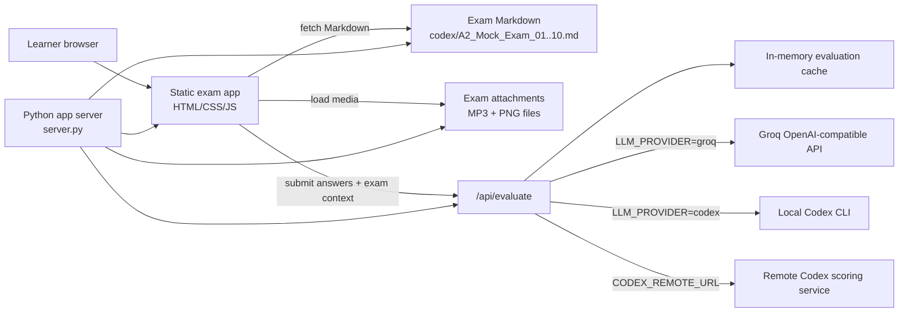
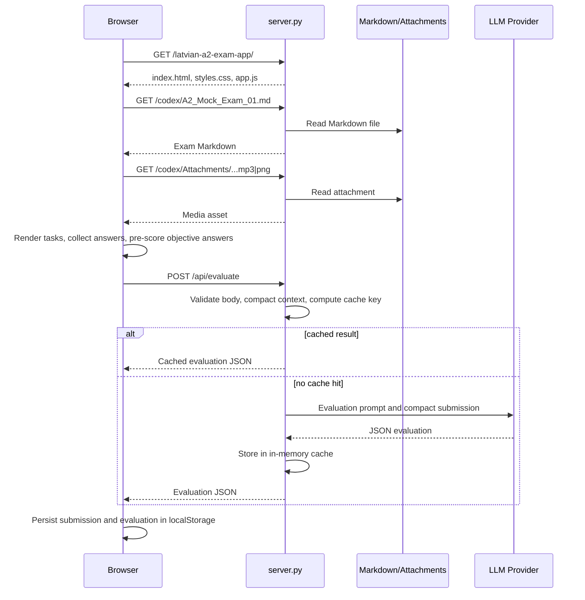
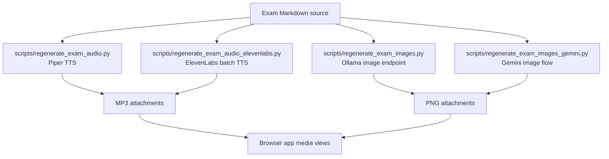

# Latvian A2 Exam Studio - Solution Architecture

## Purpose

Latvian A2 Exam Studio is a browser-based practice exam runner for Latvian A2 mock exams. It turns the existing Markdown exam vault into an interactive learner experience with timed sections, answer capture, objective pre-scoring, media playback, export tools, and optional AI-assisted scoring for writing and speaking answers.

The current implementation intentionally keeps the runtime small:

- A static HTML/CSS/JavaScript frontend in `latvian-a2-exam-app/`.
- Markdown exam source files and media attachments in `codex/`.
- A lightweight Python HTTP server in `server.py`.
- Optional LLM evaluation through Groq, local Codex CLI, or a remote Codex scoring endpoint.
- Local regeneration scripts for audio and image assets under `scripts/`.

## High-Level Architecture

## Runtime Components

### Frontend Exam App

Location: `latvian-a2-exam-app/`

The frontend is a dependency-free single-page application. `index.html` defines the shell, navigation, exam controls, result panels, and export views. `styles.css` provides the full UI. `app.js` owns application state, exam parsing, rendering, answer capture, scoring preparation, and calls to the AI evaluation endpoint.

Key frontend responsibilities:

- Populate an exam selector for `A2_Mock_Exam_01.md` through `A2_Mock_Exam_10.md`.
- Fetch selected Markdown from `/codex/A2_Mock_Exam_NN.md`.
- Extract audio and image assets from Markdown, with fallback attachment naming.
- Render interactive tasks for listening, reading, writing, and speaking.
- Track timed exam sections.
- Capture candidate identity and answers in browser state.
- Build a structured submission JSON object.
- Locally pre-score objective items from the Markdown answer key.
- Store submissions in browser `localStorage`.
- Export Markdown, JSON, and submission data.
- Submit compact evaluation payloads to `/api/evaluate`.

### Exam Content Vault

Location: `codex/`

The exam vault is the source of truth for learner-facing exam content and teacher/evaluator context. Each mock exam is a Markdown document with structured headings for the four skills:

- Klausīšanās, listening.
- Lasīšana, reading.
- Rakstīšana, writing.
- Runāšana, speaking.

Attachments are stored under `codex/Attachments/A2_Mock_Exam_NN/`. The frontend references these as `/codex/Attachments/...` at runtime.

The vault also includes operational guides and generation prompts, but `server.py` compacts evaluation context by removing large generation/export sections before sending text to an LLM.

### Python App Server

Location: `server.py`

The Python server has two responsibilities:

- Serve the repository root so the browser can load the app, Markdown, and attachment files from one origin.
- Protect AI provider credentials by handling evaluation calls server-side.

The server is implemented with `ThreadingHTTPServer` and `SimpleHTTPRequestHandler`, so there is no external web framework dependency. It accepts `POST /api/evaluate` with:

- `submission`: the compact learner submission object.
- `exam_markdown`: the current exam Markdown text.

The request body is capped at `1,500,000` bytes. The server compacts the exam context, compacts the submission, selects the configured provider, calls the provider, extracts a JSON result, and caches equivalent evaluations in memory.

### AI Evaluation Providers

Provider selection is environment-driven.

| Provider mode | Configuration | Use case |
| --- | --- | --- |
| Groq | `LLM_PROVIDER=groq`, `GROQ_API_KEY`, optional `LLM_MODEL` | Cloud LLM scoring with simple deployment. |
| Local Codex CLI | `LLM_PROVIDER=codex`, optional `CODEX_MODEL`, `CODEX_PROFILE`, `CODEX_OSS` | Local or trusted host scoring without putting Codex CLI in the container. |
| Remote Codex | `LLM_PROVIDER=codex`, `CODEX_REMOTE_URL` | Containerized app forwards scoring to a separate trusted scoring service. |

The LLM prompt asks for strict JSON with skill-level scores, pass/fail status, corrections, and feedback. Objective items are already locally pre-scored and included as context; the LLM verifies those and scores free-text writing and speaking responses.

## Data Flow

## Submission and Scoring Model

The frontend creates a submission with:

- Candidate and exam metadata.
- Per-skill progress.
- Answers grouped by skill and task.
- Extracted answer key.
- Objective scoring results.
- Validation queue for manual or AI review.
- Optional AI evaluation result.

Scoring is split intentionally:

- Objective listening and reading-like items can be scored locally from the Markdown answer key.
- Writing and speaking free text require human or AI judgment.
- The pass rule is explicit: 60 total points, 15 per skill, and at least 9/15 in every skill.

This split keeps deterministic scoring deterministic while still allowing richer feedback for language production tasks.

## Content and Media Generation

Audio generation scripts parse Markdown sections and produce MP3 files for listening and speaking tasks. Image generation scripts map Markdown image descriptions to PNG attachments for writing and speaking prompts.

These generation paths are operational tooling, not runtime dependencies. The deployed app only needs the generated Markdown and media files.

## Packaging

The `Dockerfile` builds a Python 3.13 Alpine image, copies `server.py`, `latvian-a2-exam-app/`, and `codex/`, exposes port `80`, and starts `python server.py`.

`docker-compose.yml` builds the image locally and passes runtime environment variables for provider selection, model selection, Codex remote forwarding, and timeouts. The container health check requests `/latvian-a2-exam-app/`.

There is also an `nginx.conf` in `docker/`, which is useful if the static-only serving model is revived. The current Dockerfile uses Python as both static file server and evaluation backend, which is simpler and keeps `/api/evaluate` available.

## Security Boundaries

The browser never receives provider API keys. All Groq and Codex provider details are kept in the server process environment.

Important boundaries:

- Browser boundary: learner answers and local submission history live in browser memory/localStorage.
- Server boundary: receives exam content and answers, calls LLM providers, and returns evaluation results.
- Provider boundary: compact exam context and learner submission are sent to the configured LLM provider.
- Content boundary: Markdown and media files are public to anyone who can access the app.

Production-sensitive considerations:

- Do not put `.env` files or provider keys into the Docker image.
- Do not expose host Codex credentials inside the container unless explicitly accepted.
- Treat `/api/evaluate` as a paid and potentially rate-limited operation.
- Add authentication before hosting this beyond a trusted personal or internal audience.
- Avoid logging full submissions or provider responses if real candidate data is used.

## Operational Characteristics

| Area | Current behavior | Impact |
| --- | --- | --- |
| State | Browser `localStorage` plus in-memory server cache | Simple, but not durable across browsers or restarts. |
| Scaling | Stateless except in-memory cache | Multiple instances work, but cache is per instance. |
| Secrets | Environment variables | Suitable for local and cloud secret managers. |
| Content updates | Rebuild/redeploy image or serve updated files | Simple, but not dynamic content management. |
| LLM availability | Provider-dependent | UI handles errors, but no job queue or async retry yet. |
| Observability | Basic process logs only | Needs structured logs/metrics for production. |

## Key Design Trade-Offs

The app favors low operational complexity over enterprise-grade platform features. A static frontend plus small Python server is easy to understand, run locally, containerize, and deploy. The cost is that there is no database, no central user account model, no audit trail, and no persistent scoring history outside browser storage.

The Markdown vault is a pragmatic content source. It is easy to edit, review, and regenerate, but parsing depends on stable headings and conventions. If exam formats expand, a typed content schema or build step would reduce parser fragility.

LLM scoring is isolated server-side, which is the correct security boundary for credentials. The scoring result is still model-dependent and should be positioned as practice feedback unless validated by a human or official rubric.

## Extension Points

- Replace Markdown parsing with a generated JSON manifest per exam.
- Add a persistent submission store.
- Add teacher/admin review workflows.
- Add authentication and tenant separation.
- Move evaluation into an async worker queue.
- Add object storage for media and generated exports.
- Add CDN caching for static assets.
- Add OpenTelemetry traces around evaluation calls.
- Add regression tests for Markdown parsing and answer-key extraction.

